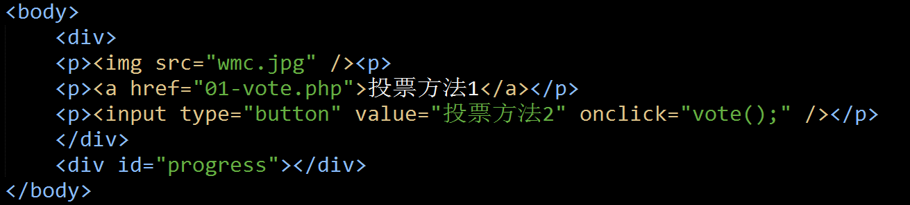
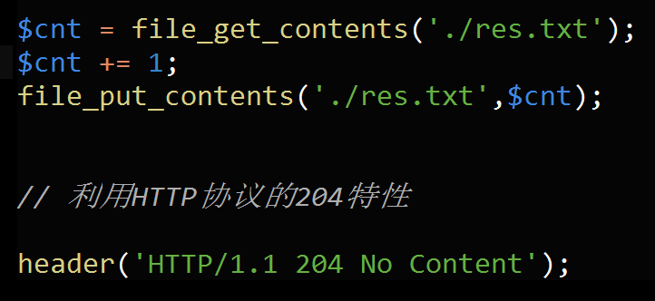
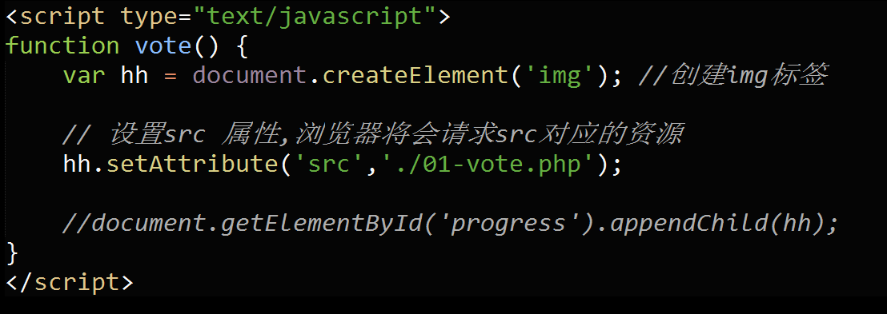
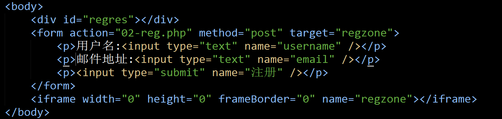
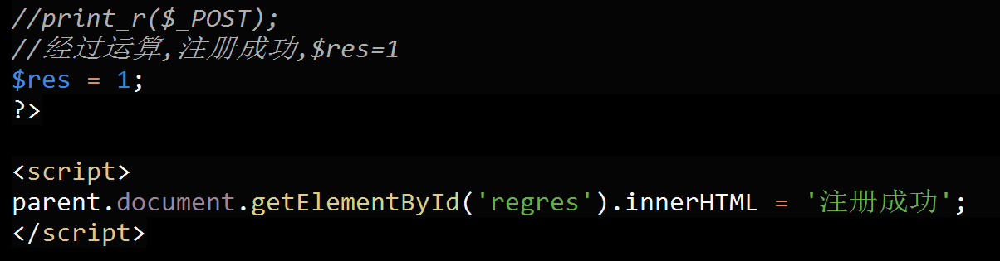

#远古时代的Ajax
　　要求：做一个在线投票，给歌手投票，要求无刷新投票，并且不允许使用XMLHttpRequest对象  
　　分析:在XHR对象没有流行之前，我们已经有“无刷新”这种效果的要求  
###方法一：
　　原理：利用204 No content状态码，当浏览器收到204时，页面不作跳转。   
  
前端   
 
   
后端效果  
    
###方法二：利用图片加载的特性来完成请求    
   
###方法三：利用css,javascript加载的特性，完成请求，原理与加载图片完全一样
　　自己测试 
###方法四：利用iframe的特性
　　Ajax注册，提交表单，页面无刷新 
    

  

#总结
在不使用XML HttpRequest对象的情况下，  
我们依然可以用js来实现对后台服务器的请求，  
同时不带来页面的刷新或跳转  

#所谓Ajax
即是指：页面不刷新的情况下，利用XMLHttpRequest发送HTTP请求。  
JS的网络化  
###思考题
Ajax上传文件能实现吗？
分析：从HTTP协议的角度看，上传文件，则要文件的内容发送到服务器。  
如果可以，XMLHttpRequest对象在POST数据时，把文件的内容也发送过去。  
-->XHR对象获取了你要上传的文件内容。  
-->javascript读取了你本地的文件内容。  
-->出于安全原因：js不能够读取文件内容的。  
--> Ajax上传文件，无法实现的。　  

###问：一些Ajax上传插件是怎么实现的?
1.iframe  
2.用flash实现，如swfuplpaded.  
3.用html5实现(html5已经增加了文件实现api,使ajax上传文件有了理论上的可能)   