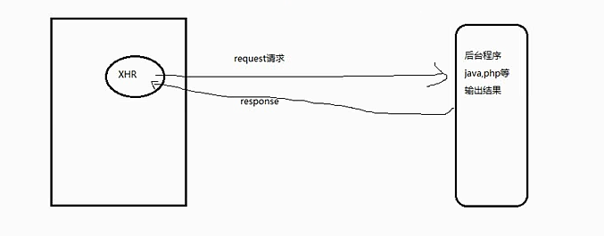
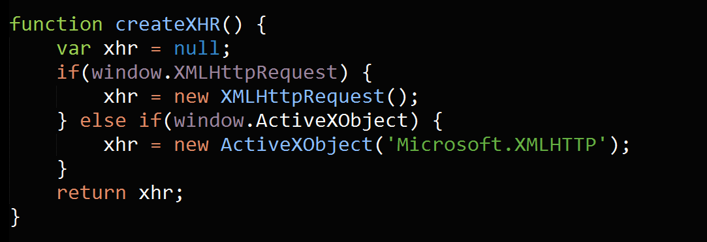
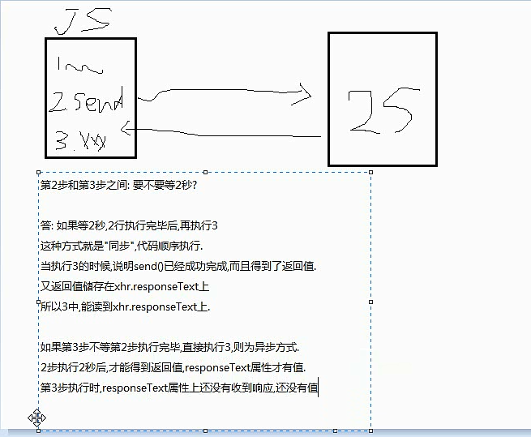

现代化的Ajax  
核心--XMLHttpRequest对象，一个专门的HTTP请求工具

如何使用XMLHttpRequest做Ajax请求?  
分析:  
1. 如何创建该对象?  
2. 如何请求后台服务器资源?  
3. 请求的结果如何利用上?  

 
 
###1.如何创建XHR对象  
答:按标准,new XMLHttpRequest()即可得到  
考虑低版本IE，可以new window ActiveXObject(Mircosoft XMLHttp)  
(在IE低版本,6,7,8使用)  
    
 

###2.如果来利用XHR发送请求?  
答：分析HTTP协议,请求需要明确这样几个因素?  
1. 用户方法来请求?  
GET,POST,PUT,DELETE,HEAD  
2. 请求哪个资源?(URL)  
3. 同步方式--同步/异步?

###3.如何获取请求的返回数据
答:XHR对象本身有一个属性:reponseText代表返回值  

###4.同步返回还是异步返回  
 

###5.引起疑问?  
如果使用异步，下面的代码继续执行，等你请求最终完成了，我该怎么回头知道这个变化呢?  
我们可以绑定一个函数，监听状态的变化，只要状态变化，就触发某函数