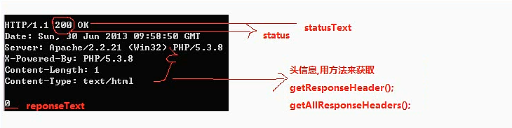

#XHR详细探讨
属性详解  
如何POST数据  
异步原理  

返回值类型  
XMLHttpRequest的详细属性   
responseTxt:服务器响应的主体信息,body信息  
responseXML:对于大量的格式文档，可以用XML来传输或交换，由后台程序把数据封装在XML文档，js接受XML对象并解析该内容。  
status:是服务器的返回状态码，例:200 成功，403 forbidden 禁止，404 not found未找到，50X 系列，内部服务器错误。  
statusText:服务器返回的状态码，对应的文字描述。  
readyState：XMLHttpRequest对象的自身的状态码,0,4 [0,1,4][2,3,4]  
onreadystatechange:事件属性，绑定当XMLHttpRequest对象的状态发生变化的时候，激发的函数  

4.XMLHttpRequest的详细方法  
open('请求方式',url,同步/异步);false->同步，true->异步  
send（null/参数)，参数写法:k1=v1&k2=v2&kn=vn  
setRequestHeader(key,value)设置的请求的头信息  
Abort忽略，不要再进行下去了，到此为止  
getResponseHeader(key,value);获取响应的某个头信息  
getAllResponseHeaders:获取响应的所有头信息  

