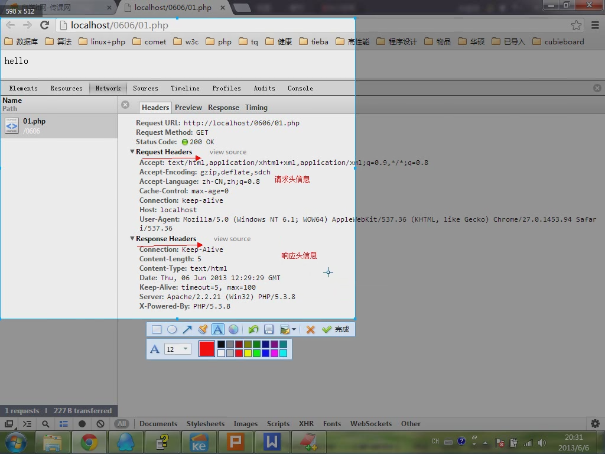
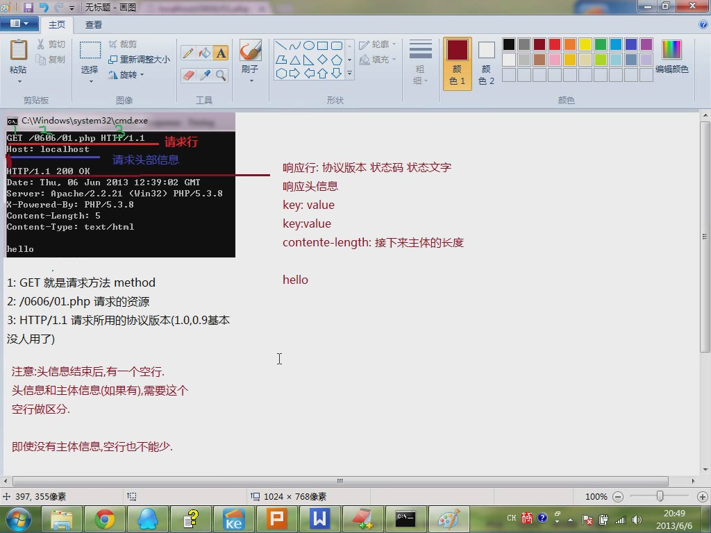
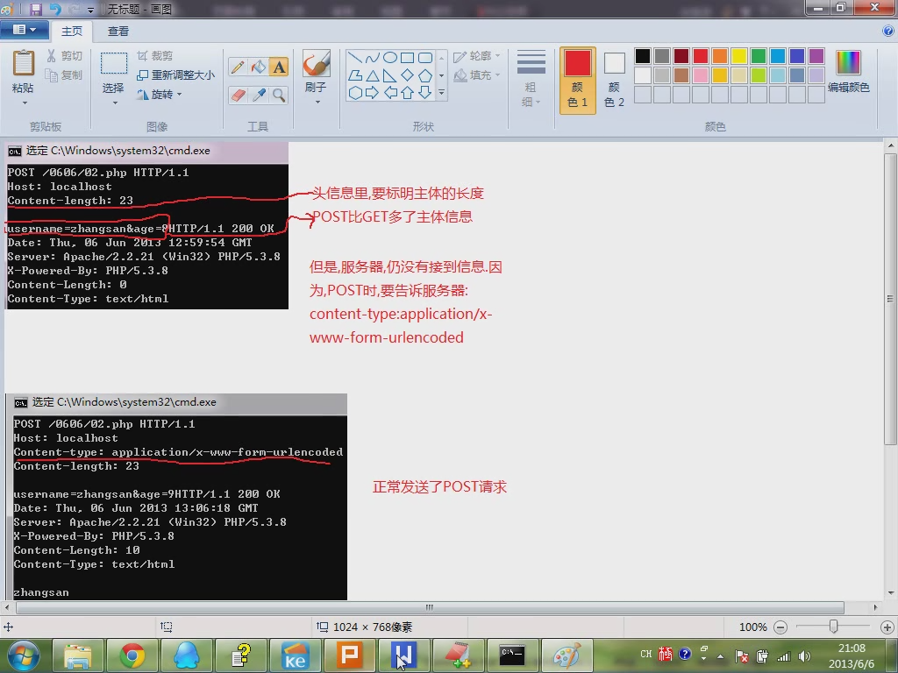

  

  
#HTTP请求信息和响应信息的格式  
###请求:
1. 请求行
2. 请求头信息
3. 请求主体信息（可以没有）
4. 头信息结束后主体信息要空一行
###请求行又分3部分:
1. 请求方法 请求路径 所用的协议
2. 请求方法:GET,POST,PUT,DELETE,TRACE,OPTIONS
3. 所用的协议：目前一般是HTTP/1.1, 0.9,1.0已经基本不用  
 
  