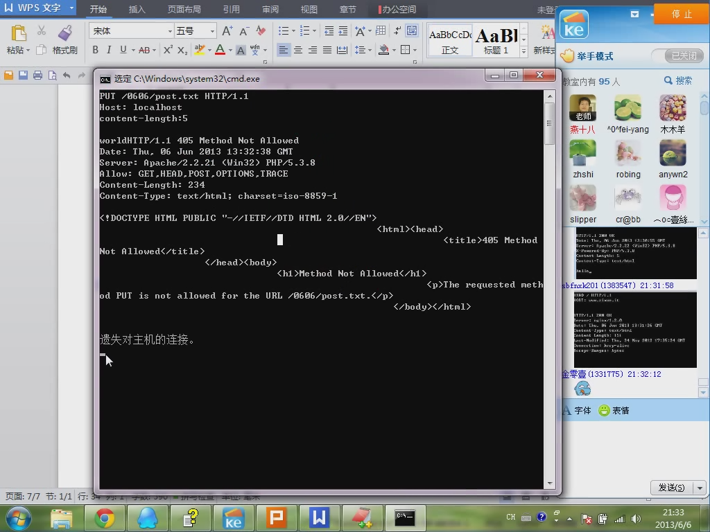

  

提示方法有哪些？ 
GET,POST,HEAD,PUT,TRACE,DELETE,OPTIONS...  

HEAD：和GET基本一致，只是不返回内容。 
比如我们只是确认一个内容（比如照片）还正常存在，不需要返回照片内容，这时用HEAD比较合适。  

TRACE:是你用了代理上网，比如用代理访问new.163.com,你想看看代理有没有修改你的HTTP请求，可以用TRACE来测试一下，163.com的服务器就会把最后收到的请求返回给你。

OPTIONS：是返回服务器可用的请求方法。
  

 
  

注意：这些请求方法虽然HTTP协议里规定的，但WEB SERVER未必允许或支持这些方法。
  

  

<h1>状态码，状态文字</h1>

状态码是用来反应服务器相应情况的 
最常见如 200 OK，404 NOT FOUND 
状态文字是用来描述状态码的，便于人观察
  

<table>
	<tr>
		<th width="100">状态码</th>
		<th width="100">定义</th>
		<th width="400">说明</th>
	</tr>
	<tr align="center">
		<td>1XX</td>
		<td>信息</td>
		<td>接收到请求，继续处理</td>
	</tr>
	<tr align="center">
		<td>2XX</td>
		<td>成功</td>
		<td>操作成功地收到，理解和接受</td>
	</tr>
	<tr align="center">
		<td>3XX</td>
		<td>重定向</td>
		<td>为了完成请求，必须采取进一步措施</td>
	</tr>
	<tr align="center">
		<td>4XX</td>
		<td>客户端错误</td>
		<td>请求的语法有错误或不能完全满足</td>
	</tr>
	<tr align="center">
		<td>5XX</td>
		<td>服务端错误</td>
		<td>服务器无法完成明显有效的请求</td>
	</tr>
</table>

  
200-服务于器成功返回网页 
301-永久重定向 
302-临时重定向 
304 NOT Modified-未修改 
307-重定向中保持原有的请求数据

失败的状态码 
404-请求的网页不存在 
503-服务器暂时不可用 
500-服务器内部错误  

