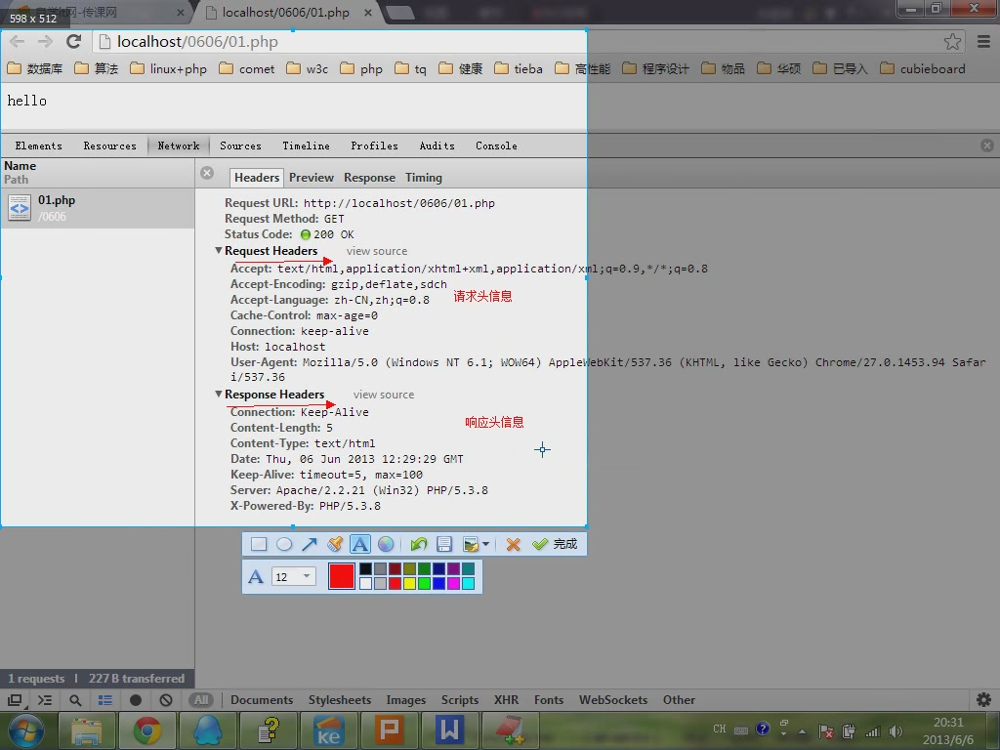
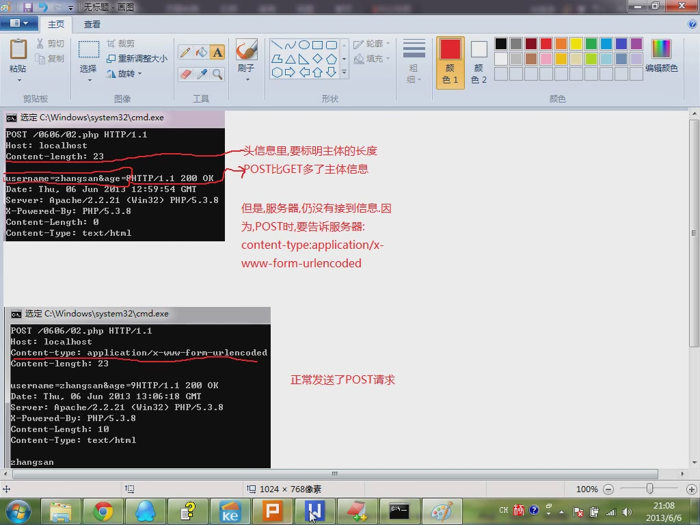

  

  

<h1>HTTP请求信息和响应信息的格式</h1>
<h3>请求:</h3>
<ol>
<li>请求行</li>
<li>请求头信息</li>
<li>请求主体信息（可以没有）</li>
<li>头信息结束后主体信息要空一行</li>
</ol>
<h3>请求行又分3部分:</h3>
<ol>
<li>请求方法 请求路径 所用的协议</li>
<li>请求方法:GET,POST,PUT,DELETE,TRACE,OPTIONS</li>
<li>所用的协议：目前一般是HTTP/1.1, 0.9,1.0已经基本不用
  </li>
</ol>

