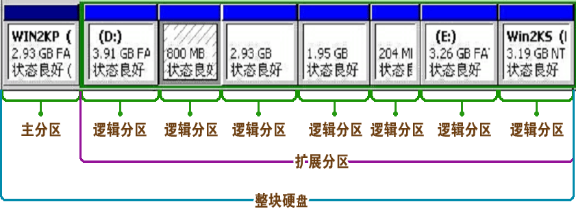
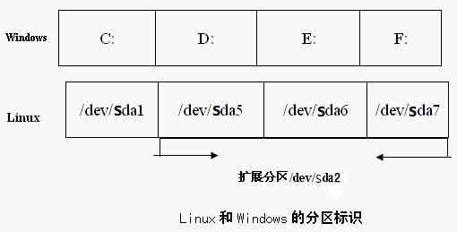

#【教程主题】：1.实验环境搭建
#【课程录制】： 创E
#【主要内容】
##【1.1】系统的选择
###Centos：
　　CentOS（Community Enterprise Operating System）是Linux发行版之一，它是来自于Red Hat Enterprise Linux依照开放源代码规定释出的源代码所编译而成。由于出自同样的源代码，因此有些要求高度稳定性的服务器以CentOS替代商业版的Red Hat Enterprise Linux使用。两者的不同，在于CentOS并不包含封闭源代码软件。
###Debian：
　　广义的Debian是指一个致力于创建自由操作系统的合作组织及其作品，由于Debian项目众多内核分支中以Linux宏内核为主，而且 Debian开发者 所创建的操作系统中绝大部分基础工具来自于GNU工程 ，因此 “Debian” 常指Debian GNU/Linux。
非官方内核分支还有只支持x86的Debian GNU/Hurd（Hurd微内核），只支持amd64的Dyson（OpenSolaris混合内核）等。这些非官方分支都存在一些严重的问题，观赏性大于实用性，比如Hurd微内核在技术上不成熟，而Dyson则基础功能仍不完善。
“Debian” 正式发音为 /ˈdɛ.bi.ən/ ，Debian 是国际化协作项目，官方未指定任何非英文名称。

##【1.2】磁盘划分
###磁盘和分区
　　硬盘分区有主分区、扩展分区和逻辑分区之分。一块硬盘最多可以有4个主分区，其中一个主分区的位置可以用一个扩展分区来替换，且一个硬盘只能有一个扩展分区，在这个扩展分区内可以划分多个逻辑分区。  

如图：  

  
  
####磁盘分区的设备名
在Linux中用户用设备名来访问设备，磁盘也不例外。  

磁盘设备名称如下：  

- 系统的第一块IDE接口的硬盘称为/dev/hda以此类推。分区则使用数字编号表示。如：/dev/hda1  /dev/hdb2  
- 数字编号1~4留给主分区或扩展分区使用，逻辑分区编号从5开始。  
- SAS/SCSI/SATA/USB接口硬盘的名称均以/dev/sd[a-p]表示。  
 

在Windows系统中使用盘符来标识不同的分区，而在Linux中使用分区的设备名来标识不同的分区：
  

  
注意：数字编号1—4是留给主分区或扩展分区使用，逻辑分区编号从5开始。

高扩展企业分区方案：
  
	/boot     200MB    
	/         50GB  
	/var	  20GB  
	swap      2048  
	/usr      100GB   /usr/local  
	/home     100GB  
	/         和 swap最重要必须得存在  　　

#【1.3】Vitrualbox使用

#【1.4】安装演示
	[http://mirrors.163.com/centos/6.4/isos/x86_64/](http://mirrors.163.com/centos/6.4/isos/x86_64/)

#【1.5】网络配置
	/etc/sysconfig/network-scripts/ifcfg-eth0
	DEVICE=eth0
	BOOTPROTO=static
	HWADDR=08:00:27:F0:95:DD
	IPADDR=192.168.1.150
	NETMASK=255.255.255.0
	GATEWAY=192.168.1.1
	ONBOOT=yes

#【1.6】改变语言环境
	/etc/sysconfig/i18n
#【1.7】切换启动级别
	/etc/inittab
#【1.8】VirtualBox 备份和克隆的妙用

