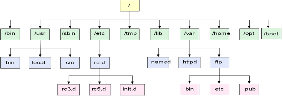
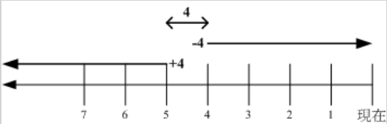

#【教程主题】：2.Linux高频命令精讲
#【课程录制】： 创E
#【主要内容】
##【2.1】Linux的运行方式
###图形运行方式
* 本地使用KDE/Gnome集成环境
* 运行X Server远程使用图形环境
###命令行（字符运行）方式  
* 本地虚拟终端
* 使用Telnet远程登录
* 使用SSH远程登录
##2.2字符界面的使用
###为什么要使用字符工作方式
* 可以高效率的完成任务
* 远程登录操作均使用字符界面
* 节省系统资源
###进入字符模式的方法
* 图形环境下，右键桌面  —> 终端
* 系统启动后直接进入字符模式
* 远程telnet（明文）或SSH（加密）登陆字符模式

##【2.3】本地登录和远程登陆
###本地登录
####虚拟控制台
* 在系统启动时直接进入字符工作方式后，系统提供了多个（默认为6个）虚拟控制台。每个虚拟控制台可以互相独立使用，互不影响。
* 可以使用Alt+F1~Alt+F6进行多个虚拟控制台之间的切换。
####字符界面下登陆Linux
* Linxu系统是严格区分大小写的，无论用户名，还是文件名、设备名都是如此。
* 基于安全的考虑，一般应该使用普通用户登录系统，不要使用root用户登录，当需要进行超级用户的工作时 可以使用 su – 命令切换为超级用户身份。
* logout登出　　exit退出　　都是注销操作     
* 命令提示符后　　#为root用户　　$为普通用户
###远程登陆
####Linux下远程登录另一台Linux服务器
* Linux下的ssh命令是OpenSSH的客户端程序。要登陆远程Linux系统，必须保证远程Linux系统上启动了OpenSSH服务器。 
使用ssh命令登陆远程  OpenSSH服务器的命令格式是：  
　　$ssh  远程主机上的用户名@远程主机的ip地址或主机名 
　　$ssh   IP地址
* Windows下利用SSH工具登录一台linux服务器 
　　SecureCRT.exe 
　　[http://baike.baidu.com/view/489722.htm](http://baike.baidu.com/view/489722.htm)   百度百科介绍 
　　xshell 
##【2.4】Linux的系统运行级别
	0 - 系统关机状态
	1 - 单用户工作状态，用于维护。
	2 - 多用户模式（NFS未启动）
	3 - 多用户模式， 字符界面。
	4 - 系统未使用，留给用户自定义
	5 – 多用户模式，并且在系统启动后运行X Window，给出一个图形化的登录窗口。
	6 – 所有进程被终止，重新启动
###查看当前系统的运行级别
	#runlevel
###切换运行级别
	#init[0123456]
##【2.5】linux的目录结构
Linux文件系统是呈树形结构，了解Linux文件系统的目录结构，对于我们驾驭Linux还是有必要的。
  

  

<table>
	<tr>
		<th width="100">目录</th>
		<th width="500">说明</th>
	</tr>
	<tr>
		<td align="center">/</td>
		<td align="center">Linux文件系统的入口，也是处于最高一级的目录</td>
	</tr>
	<tr>
		<td align="center">/bin</td>
		<td align="center">基本系统所需要的命令。功能和/usr/bin类似，这个目录中的文件都是可执行的，普通用户都可以使用的命令</td>
	</tr>
	<tr>
		<td align="center">/boot</td>
		<td align="center">内核和加载内核所需要的文件。一般情况下，GRUB系统引导管理器也位于这个目录</td>
	</tr>
	<tr>
		<td align="center">/dev</td>
		<td align="center">设备文件存储目录，比如终端、磁盘等</td>
	</tr>
	<tr>
		<td align="center">/etc</td>
		<td align="center">所有的系统配置文件</td>
	</tr>
	<tr>
		<td align="center">/home</td>
		<td align="center">普通用户家目录的默认存放目录</td>
	</tr>
	<tr>
		<td align="center">/lib</td>
		<td align="center">库文件和内核模块所存放的目录</td>
	</tr>
	<tr>
		<td align="center">/media</td>
		<td align="center">即插即用型存储设备的挂载点自动在这个目录下创建，比如u盘、CDROM/DVD自动挂载后，也会在这个目录中创建一个目录。</td>
	</tr>
	<tr>
		<td align="center">/mnt</td>
		<td align="center">临时文件系统的挂载点目录</td>
	</tr>
	<tr>
		<td align="center">/opt</td>
		<td align="center">第三方软件的存放目录</td>
	</tr>
	<tr>
		<td align="center">/root</td>
		<td align="center">Linux超级权限用户root的家目录</td>
	</tr>
	<tr>
		<td align="center">/sbin</td>
		<td align="center">基本的系统维护命令，只能由超级用户使用</td>
	</tr>
	<tr>
		<td align="center">/srv</td>
		<td align="center">该目录存放一些服务启动之后需要提取的数据</td>
	</tr>
	<tr>
		<td align="center">/tmp</td>
		<td align="center">临时文件目录</td>
	</tr>
	<tr>
		<td align="center">/usr</td>
		<td align="center">存放用户使用系统命令和应用程序等信息，比如命令、帮助文件等。</td>
	</tr>
	<tr>
		<td align="center">/var</td>
		<td align="center">存放经常变动的数据，比如日志、邮件等。</td>
	</tr>
<table>
 
###几个特殊的文件系统
<table>
	<tr>
		<th width="100">文件系统</th>
		<th width="100">挂载点</th>
		<th width="500">说明</th>
	</tr>
	<tr>
		<td align="center">root</td>
		<td align="center">/</td>
		<td align="center">Linux系统运行的基点，根文件系统不能被卸载</td>
	</tr>
	<tr>
		<td align="center">proc</td>
		<td align="center">/proc</td>
		<td align="center">以文件系统的方式为访问系统内核数据的操作提供接口，适用于2.4和2.6内核</td>
	</tr>
	<tr>
		<td align="center">sysfs</td>
		<td align="center">/sys</td>
		<td align="center">以文件系统的方式为访问系统内核数据的操作提供接口，2.6内核使用</td>
	</tr>
	<tr>
		<td align="center">tmpfs</td>
		<td align="center">/dev　/var/run　/var/lock</td>
		<td align="center">程序访问共享内存资源时使用的文件系统</td>
	</tr>
	<tr>
		<td align="center">usbfs</td>
		<td align="center">/proc/bus/usb</td>
		<td align="center">访问usb设备时使用的文件系统</td>
	</tr>
	<tr>
		<td align="center">devpts</td>
		<td align="center">/dev/pts</td>
		<td align="center">内核用来与伪终端（以远程方式登陆）进行交互的文件系统</td>
	</tr>
	<tr>
		<td align="center">swap</td>
		<td align="center">内核使用的特殊文件系统，无挂载点</td>
		<td align="center">用来创建虚拟内存</td>
	</tr>
</table>
 
#【2.6】linux命令
##Linux命令的习惯
	- 命令及参数区分大小写
	- 程序可否执行与扩展名无关
	- 使用tab键来补全命令
	$command  [-options]    parameter1   parameter2  …
	指令          选项          参数1        参数2

	说明：
		0. 一行指令中第一个输入的绝对是‘指令(command)’或‘可执行文件’
		1. command 为指令的名称，例如变换路径的指令为 cd 等等；
		2. 中刮号[]并不存在于实际的指令中，而加入参数设定时，通常为 - 号，例如   -h； 有时候完整参数名称会输入 -- 符号，例如 --help；
		3. parameter1 parameter2.. 为依附在 option 后面的参数， 或者是 command        的参数； 
		4. command, -options, parameter1.. 这几个中间以空格来区分，不论空几格 shell 都视为一格； 
		5. 按下 [Enter] 按键后，该指令就立即执行。
		6. 指令太长的时候，可以使用 \ 符号来跳脱 [Enter] 符号， 使指令连续到下一行。注意！ \ 后就立刻接特殊字符。
		7. 在 Linux 系统中，英文大小写字母是不一样的。举例来说， cd 与 CD 并不同。
##常用命令介绍
###pwd	
	查看当前工作目录
###cd  
	更换目录
	用法：
	cd    [目录]
<table>
	<tr>
		<th width="100">符号</th>
		<th width="400">意义</th>
	</tr>
	<tr>
		<td align="center">.</td>
		<td align="center">当前工作目录</td>
	</tr>
	<tr>
		<td align="center">..</td>
		<td align="center">父目录</td>
	</tr>
	<tr>
		<td align="center">~</td>
		<td align="center">用户家目录</td>
	</tr>
	<tr>
		<td align="center">-</td>
		<td align="center">上个工作目录</td>
	</tr>
</table>
 
###ls
	显示目录
	用法：  ls  [参数]   [目录名]
	ls 参数：
		-a：显示所有文件，包括隐藏文件(以.开头的文件)
		-l：以长格式显示
		-t：按修改时间先后显示
		-R：显示目录及下级子目录结构（递归）
		-m:  横向输出文件名，并以“，”作分格符。 
		-S:  以文件大小排序。 
		
		用颜色代表不同文件
			白色：普通文件
			红色：压缩文件
			蓝色：目录文件
			浅蓝色：链接文件
			黄色：设备文件（/dev）
			绿色：可执行文件（/bin、/sbin）
			粉红色：图片文件  

###mkdir
	建立目录
	用法： mkdir  [参数]   {目录名}
	参数： 
			-p 可以一次性创建整个目录树
###rmdir
	删除目录
	用法： rmdir  [参数]   {目录名}

> 如果目录是空的，此命令会删除他们，如果目录中有内容，则会产生错误信息且不能删除目录，但是他会继续删除其余的空目录。注意，只包括一个子目录的目录不是空的。
###rm 
	删除文件和文件夹
	用法： rm   [参数]   {文件}
	参数： 
	         -r   删除整个目录树
	         -f   强制执行
###tree
	显示文件和目录树
	用法：  tree    [参数]   {文件}
	参数：   
			-a   不隐藏任何以.字符开始的条目
	     	-d   只显示目录不显示文件
	        -f    每个文件都显示路径
	        -t   根据最后修改时间排序
	        -L n 只显示n层目录 （n为数字）
###touch
	创建空文件和更改时间戳
	用法：touch  [参数]   {文件}
	参数：   
			-d    更改时间戳为定义值   （后面加年月日，格式：20101212）
###cp
	复制目录
	用法： cp  [参数]   {原文件…}  {目标文件}
	参数：  
			-r  递归执行  （可复制目录树）
###mv  
	移动或重命名文件
	用法：　　mv  [参数]  {原文件} {目标文件}     把原文件更名为目标文件
	　　　　　mv  [参数]  {原文件…} {目标文件}    把一个或多个文件同时移动到目标文件中
###查看文档：
	cat  由第一行开始显示文件的内容 
	cat命令显示文件时会同时显示所有内容。大型文件在屏幕上一晃而过，难以阅读。所以他比较适合小于一屏的文件。
	用法：　　cat [option] filename

###tac 
	从最后一行开始显示 

###file
	显示文件类型
	file   [option] filename

###more 
	一页一页的显示档案内容 ：
		空格键 (space)：代表向下翻一页； 
		Enter：代表向下翻『一行』； 
		/字符串：代表在这个显示的内容当中，向下搜索『字符串』这个关键词； 
		:f ：立刻显示出文件名以及目前显示的行数； 
		h 帮助
		b 或 [ctrl]-b ：代表往回翻页 
		q：退出 

###less 
	与 more 类似，less可以往前翻页！ ：
		空格键：向下翻一页； 
		[pagedown]：向下翻一页； 
		[pageup]：向上翻一页； 
		/字符串：向下搜索『字符串』； 
		?字符串 ：向上搜索『字符串』； 
		n：重复前一个搜索 
		N：反向的重复前一个搜索
		h：帮助
		q：退出

###head显示文件开始几行
	用法：　head [options]  {file…}
	参数 ：  
			–n  number查看前几行的值
###tail显示文件最后几行
	用法：	tail  [options]  {file…}
	参数 ： 
			 –n  number 查看后几行的值
             –f    一直监视

###man 帮助文档
	路径：/usr/share/man
	用法： man  [参数]  [查询名]  
 			/   来查找
			q退出

			其他获得帮助的方法
			--help
			-h
			info  命令
			help  内置命令
			readme
###关机
	将数据同步写入硬盘：sync

	shutdown命令
	shutdown命令的格式为：#shutdown [参数]  时间  [警告信息]
									-t  sec ：送出警告信息和删除信息之间要延迟多少秒
									- k：并不真正关机而只是发出警告信息给所有用户
									- r：关机后立即重新启动
									- h：关机后停止系统
									
	init 0
	重启：reboot  init6
###别名
	alias rm='rm -i'
	alias cp='cp -i'
	alias mv='mv -i'
	alias ls='ls --color=auto'
	alias ll='ls -lh --color=auto'
	alias l='ls --color=auto'
	alias grep='grep --color=auto'
	debian系统的时候要在/etc/profile里面进行设置
###find
	[root@www ~]# find [PATH] [option] [action] 
	选项与参数： 

	1. 不时间有关的选项：共有 -atime, -ctime 与 -mtime ，以 -mtime 说明 
   		-mtime  n ：n 为数字，意义为在 n 天之前的『一天之内』被更改过内容的文件
   		-mtime +n ：列出在 n 天之前(不含 n 天本身)被改动过内容的文件； 
   		-mtime -n ：列出在 n 天之内(含n 天本身)被更改过内容的文件。 
   		-newer file ：file 为一个存在参照物，列出比 file 还要新的文件 
 

  

	[root@www ~]# find / -mtime 0 
	# 那个 0 是重点！0 代表目前的时间，所以，从现在开始到 24 小时前，有改动过内容的文件都会被列出来
	find / -mtime 3  #3天内改动过的文件
	find / -name file –exec ls –l {} \;

	文件的 Access time，atime 是在读取文件或者执行文件时更改的。
	文件的 Modified time，mtime 是在写入文件时随文件内容的更改而更改的。
	文件的 Create time，ctime 是在写入文件、更改所有者、权限或链接设置时随 Inode 的内容更改而更改的。

	ls -lc filename 列出文件的 ctime
	ls -lu filename 列出文件的 atime
	ls -l filename 列出文件的 mtime

###查看命令历史
	history

###环境变量
	PATH命令搜索的路径
	export PATH=/usr/bin:/usr/local/zabbix/bin:/usr/local/php5/bin

###管道
	grep
		-c 只输出匹配行的计数。
		-i 不区分大小写（只适用于单字符）。
		-h 查询多文件时不显示文件名。
		-l 查询多文件时只输出包含匹配字符的文件名。
		-n 显示匹配行及行号。
		-s 不显示不存在或无匹配文本的错误信息。
		-v 显示不包含匹配文本的所有行。

###sort -r 反向排序
###cut –d ‘分割符’ –f 取第几段
###uniq –c 计数
###wc –l 统计多少行

#linux中的正则
###&&且
###||或
###几个概念：
	1. 基本正则表达式  扩展的正则表达式  （由普通字符+元字符组成）
	2. 通配                           （由普通字符+元字符组成）
	3. 元字符

> 注意：正则表达式中元字符的意义和通配中元字符的意义有区别的

> bash shell本身不支持正则表达式，使用正则表达式的是shell的一些命令和工具，如grep,sed,awk等等  
> 但是bash可以使用正则表达式中的一些元字符实现通配的功能，此时的这些元字符叫通配符。
> 此时通配中元字符的意义跟正则表达式中元字符的意义就不一样了。

###通配是指：将一个包含通配符的非具体的文件名扩展为计算机，服务器，网络上的一批具体的文件名的过程。

基本正则表达式中元字符的意义如下：
####1.   *     匹配*前面的那一个字符的0次或多次
	如hel*o       heo  helo  hello  helllo  ......
####2.   .     匹配任意一个字符（只匹配一个，可以是空格）
	如ab.         abc  abd   ab3   ab   ......
####3.   ^     匹配行首，行首的字符序列必须是^后的字符序列
	如^suda       sudahuhuhuuuuuhuuh      sudaokokokokokoko   ......
####4.   &     匹配行尾，行尾的字符序列必须是$前的字符序列
	如suda$       jijijijijiiijijsuda     lkokokokokjijhuhsuda   ......
	特殊的  ^$      匹配一个空行
		   ^.$     匹配只有一个字符的空行
####5.   []    匹配字符集合中的任意一个字符（只匹配一个）
	如[1234]  [1-4]     匹配1，2，3，4的任意一个字符

	注意：^放在[]里面时，不再表示匹配行首，而是取反的意思
	[^1234]  [^1-4]       匹配不是1，2，3，4的任意一个字符
	[a-z][A-Z]*  匹配任意一个英文单词 
####6.   \     用于转义元字符，使之成为普通字符
	如\*       此时*表示一个普通字符
####7.   \<\>     用于精确匹配
	如\<the>\      表示精确匹配the这个单词，而不是them  then等等
####8.\{\}系列符号
	\{n\}       匹配前面字符的n次
	\{n,\}      匹配前面字符的至少n次
	\{n,m\}     匹配前面字符的n-m次，至少n次，至多m次

	如JO\{3\}B    匹配JOOOB
	如JO\{3,\}B   匹配JOOOB  JOOOOB   ......
	如JO\{3,6\}B  匹配JOOOB  JOOOOB   JOOOOOB   JOOOOOOB   

###扩展的正则表达式中元字符的意义如下：
####1.    ？    匹配前面的那一个字符的0次或1次
	如JO?B      匹配   JB     JOB    JOOB
####2.    +     匹配前面的那一个字符的1次或多次
	如JO+B      匹配   JOOB   JOOOB   ......
####3.    |与（）通常结合使用，表示一组可选的字符集合
	如re(a|o|e)d     匹配read  reod  reed
	等同于re[aoe]d       

####通配中的元字符的意义如下：
	1.     *       表示任意多的任意字符
	2.     ?       表示一个任意字符
	3.     ^       表示取反
	4.     []      同正则表达式的用法
	5.     {}      表示一组表达式的集合   {}中表达式是或的关系
	如ls -l  {*.cpp , [1234]*.c}            列出满足表达式*.cpp或者[1234]*.c的文件。