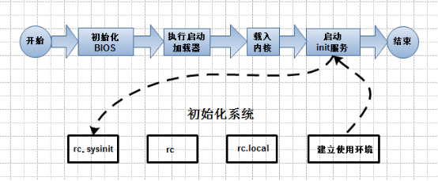

<h1>【教程主题】：2.linux 的服务与进程管理</h1>
<h1>【课程录制】： 创E</h1>
<h1>【主要内容】</h1>
<h2>【2.1】系统启动流程</h2>

简单的介绍下linux的系统启动流程，方便我们深入了解linux操作系统，对排除linux系统故障进行帮助。启动流程虽然简单但背后还有着更加复杂的底层函数调用，等待咱们去研究，本节课就算抛砖引玉了。 
  

<h3>启动第一步－－加载BIOS</h3>

　　当你打开计算机电源，计算机会首先加载BIOS信息，BIOS信息是如此的重要，以至于计算机必须在最开始就找到它。这是因为BIOS中包含了CPU的相关信息、设备启动顺序信息、硬盘信息、内存信息、时钟信息、PnP特性等等。在此之后，计算机心里就有谱了，知道应该去读取哪个硬件设备了。

<h3>启动第二步－－读取MBR</h3>

　　众所周知，硬盘上第0磁道第一个扇区被称为MBR，也就是Master Boot Record，即主引导记录，它的大小是512字节，别看地方不大，可里面却存放了预启动信息、分区表信息。
系统找到BIOS所指定的硬盘的MBR后，就会将其复制到0×7c00地址所在的物理内存中。其实被复制到物理内存的内容就是Boot Loader，而具体到你的电脑，那就是lilo或者grub了。

<h3>启动第三步－－Boot Loader</h3>

　　Boot Loader 就是在操作系统内核运行之前运行的一段小程序。通过这段小程序，我们可以初始化硬件设备、建立内存空间的映射图，从而将系统的软硬件环境带到一个合适的状态，以便为最终调用操作系统内核做好一切准备。 
　　Boot Loader有若干种，其中Grub、Lilo和spfdisk是常见的Loader。 
　　我们以Grub为例来讲解吧，毕竟用lilo和spfdisk的人并不多。 
　　　　系统读取内存中的grub配置信息（一般为menu.lst或grub.lst），并依照此配置信息来启动不同的操作系统。

<h3>启动第四步－－加载内核</h3>

　　根据grub设定的内核映像所在路径，系统读取内存映像，并进行解压缩操作。此时，屏幕一般会输出“Uncompressing Linux”的提示。当解压缩内核完成后，屏幕输出“OK, booting the kernel”。 
　　系统将解压后的内核放置在内存之中，并调用start_kernel()函数来启动一系列的初始化函数并初始化各种设备，完成Linux核心环境的建立。至此，Linux内核已经建立起来了，基于Linux的程序应该可以正常运行了。

<h3>启动第五步－－用户层init依据inittab文件来设定运行等级</h3>

　　内核被加载后，第一个运行的程序便是/sbin/init，该文件会读取/etc/inittab文件，并依据此文件来进行初始化工作。 
　　其实/etc/inittab文件最主要的作用就是设定Linux的运行等级，其设定形式是“：id:5:initdefault:”，这就表明Linux需要运行在等级5上。Linux的运行等级设定如下：

<pre>
0：关机
1：单用户模式
2：无网络支持的多用户模式
3：有网络支持的多用户模式
4：保留，未使用
5：有网络支持有X-Window支持的多用户模式
6：重新引导系统，即重启
关于/etc/inittab文件的学问，其实还有很多，以后运用到我们会逐步讲解。
</pre>
<h3>启动第六步－－init进程执行rc.sysinit</h3>

　　在设定了运行等级后，Linux系统执行的第一个用户层文件就是/etc/rc.d/rc.sysinit脚本程序，它做的工作非常多，包括设定PATH、设定网络配置（/etc/sysconfig/network）、启动swap分区、设定/proc等等。如果你有兴趣，可以到/etc/rc.d中查看一下rc.sysinit文件，里面的脚本够你看几天的。

<h3>启动第七步－－启动内核模块</h3>

　　具体是依据/etc/modules.conf文件或/etc/modules.d目录下的文件来装载内核模块。

<h3>启动第八步－－执行不同运行级别的脚本程序</h3>

　　根据运行级别的不同，系统会运行rc0.d到rc6.d中的相应的脚本程序，来完成相应的初始化工作和启动相应的服务。 
　　具体位置：/etc/rc.d/

<h3>启动第九步－－执行/etc/rc.d/rc.local</h3>

你如果打开了此文件，里面有一句话，读过之后，你就会对此命令的作用一目了然：

<pre>
# This script will be executed *after* all the other init scripts.
# You can put your own initialization stuff in here if you don’t
# want to do the full Sys V style init stuff.
</pre>

rc.local就是在一切初始化工作后，Linux留给用户进行个性化的地方。你可以把你想设置和启动的东西放到这里。  

<h3>启动第十步－－执行/bin/login程序，进入登录状态</h3>

　　此时，系统已经进入到了等待用户输入username和password的时候了，你已经可以用自己的帐号登入系统了。漫长的启动过程结束了，一切都清静了…

<h2>【2.2】服务的介绍</h2>

　　在开始介绍如何管理Linux的服务前，先为你介绍Linux的服务究竟有哪些。这些服务的分类方法，以及一些关于服务的基本概念

<h3>服务的种类</h3>

　　Linux提供了许多的服务。这些服务，可以使依照其功能和依照服务启动的方法与执行时的特性进行分类。  

<h4>依照功能分类：</h4>
<ul>
<li>系统服务</li>
</ul>
<pre>某些服务的服务对象是Linux系统本身，或者Linux系统用户，这类的服务我们称为系统服务（System Service）</pre>
<ul>
<li>网络服务</li>
</ul>
<pre>提供给网络中的其他客户端（Clients）调用使用的服务，这类的服务我们统称为网络服务（Networking Service）。</pre>
<h4>依照服务启动的方法分类</h4>
<ul>
<li>独立系统服务</li>
</ul>
<pre>服务一经启动，除非因为关闭系统或者管理者手动结束，否则都将在后台执行，不管有没有被用到。
这样的服务我们称为独立系统服务(Standalone Service)。 独立系统服务有时候又被称为Sys V服务 （Sys V Service）</pre>
<ul>
<li>临时服务</li>
</ul>
<pre>与独立系统服务不同，临时服务（Transient Service）平时并不会启动，而是当客户端需要时才会被启动，使用完毕会结束。</pre>
<h2>【2.2】服务的管理</h2>
<h3>手动的启动或停止独立系统服务</h3>

　　为了简化Linux服务管理的麻烦，Linux特别为每一个独立式的服务，提供了一个服务启动程序文件（Service Startup Script）。 
　　所有的服务启动文件被储存在/etc/rc.d/init.d/目录下

<h3>如何利用脚本直接管理服务</h3>

　　/etc/rc.d/init.d/里面每一个文件就是某一个服务的启动程序文件，你可以直接执行某一个启动程序文件，借以来启动或者停止该服务

<pre>
不同的服务启动文件可能会有不同的动作参数：
-start：	启动这个服务
-stop：		停止这个服务
-restart：	先停止，再启动，也就是重新启动的意思。
-reload：	重载配置文件，这个参数只有在服务已经启动的状况下才     能使用。
-condrestart：有条件的重新启动，这个服务必须是已经启动的，才会被重新启动；如果这个服务尚未启动，则无须启动之。
-status：	查看目前服务的启动状态。
</pre>
<h3>service命令管理方法</h3>
<pre>
用法： service    filename   action
动作参数：
start
stop
status
</pre>
<h2>【2.3】守护进程</h2>

inetd是一个特殊的程序，不断监控所有通讯端口。一旦有客户端调用某一个启动文件时，这个程序就要负责启动该服务；而在客户端使用完毕后，改程序也必须要负责结束。

<pre>
守护进程服务位置：/etc/xinetd.d
service    xinetd      start/stop/status
</pre>
<h2>【2.4】服务的自启动</h2>

chkconfig命令主要用来更新（启动或停止）和查询系统服务的运行级信息。谨记chkconfig不是立即自动禁止或激活一个服务，它只是简单的改变了符号连接。  

<pre>
使用语法：
chkconfig [--add][--del][--list][系统服务] 或 chkconfig [--level <等级代号>][系统服务][on/off/reset] 
参数用法：
--add 　增加所指定的系统服务，让chkconfig指令得以管理它，并同时在系统启动的叙述文件内增加相关数据。
--del 　删除所指定的系统服务，不再由chkconfig指令管理，并同时在系统启动的叙述文件内删除相关数据。
--level<等级代号> 　指定读系统服务要在哪一个执行等级中开启或关毕。
等级0表示：表示关机
等级1表示：单用户模式
等级2表示：无网络连接的多用户命令行模式
等级3表示：有网络连接的多用户命令行模式
等级4表示：不可用
等级5表示：带图形界面的多用户模式
等级6表示：重新启动
需要说明的是，level选项可以指定要查看的运行级而不一定是当前运行级。
对于每个运行级，只能有一个启动脚本或者停止脚本。
当切换运行级时，init不会重新启动已经启动的服务，也不会再次去停止已经停止的服务。
chkconfig --list [name]：显示所有运行级系统服务的运行状态信息（on或off）。
如果指定了name，那么只显示指定的服务在不同运行级的状态。
chkconfig --add name：增加一项新的服务。chkconfig确保每个运行级有一项启动(S)或者杀死(K)入口。
                      如有缺少，则会从缺省的init脚本自动建立。
chkconfig --del name：删除服务，并把相关符号连接从/etc/rc[0-6].d删除。
chkconfig [--level levels] name：设置某一服务在指定的运行级是被启动，停止还是重置。
使用范例：
chkconfig --list #列出所有的系统服务
chkconfig --add httpd #增加httpd服务
chkconfig --del httpd #删除httpd服务
chkconfig --list #列出系统所有的服务启动情况
chkconfig --list mysqld #列出mysqld服务设置情况
chkconfig --level 35 mysqld on #设定mysqld在等级3和5为开机运行服务，
          --level 35表示操作只在等级3和5执行，on表示启动，off表示关闭
chkconfig mysqld on #设定mysqld在各等级为on，“各等级”包括2、3、4、5等级
</pre>
<h2>2.4【screen用法】</h2>

Screen被称之为一个全屏窗口管理器，用他可以轻松在一个物理终端上获得多个虚拟终端的效果。  

<h3>Screen功能说明：</h3>

　　简单来说，Screen是一个可以在多个进程之间多路复用一个物理终端的窗口管理器,这意味着你能够使用一个单一的终端窗口运行多终端的应用。Screen中有会话的概念，用户可以在一个screen会话中创建多个screen窗口，在每一个screen窗口中就像操作一个真实的telnet/SSH连接窗口那样。

<pre>
Screen命令语法：
screen [-AmRvx -ls -wipe][-d < >][-h < >][-r < >][-s ][-S < >]
Screen命令参数：
-A -[r|R]            将所有的视窗都调整为目前终端机的大小。
-c filename          用指定的filename文件替代screen的配置文件’.screenrc’.
-d [pid.tty.host]    断开screen进程(使用该命令时，screen的状态一定要是Attached，也就是说有用户连在screen里)。
                     一般进程的名字是以pid.tty.host这种形式表示(用screen -list命令可以看出状态)。
-D [pid.tty.host]    与-d命令实现一样的功能，区别就是如果执行成功，会踢掉原来在screen里的用户并让他logout。
-h < > 　            指定视窗的缓冲区行数。
-ls或–list           显示目前所有的screen作业。
-m                   即使目前已在作业中的screen作业，仍强制建立新的screen作业。
-p number or name    预先选择一个窗口。
-r [pid.tty.host]    恢复离线的screen进程，如果有多个断开的进程，需要指定[pid.tty.host]
-R                   先试图恢复离线的作业。若找不到离线的作业，即建立新的screen作业。
-s shell             指定建立新视窗时，所要执行的shell。
-S < >               指定screen作业的名称。(用来替代[pid.tty.host]的命名方式,可以简化操作).
-v                    显示版本信息。
-wipe                检查目前所有的screen作业，并删除已经无法使用的screen作业。
-x                   恢复之前离线的screen作业。
</pre>
<h3>Screen命令的常规用法:</h3>
<pre>
screen -d -r:连接一个screen进程，如果该进程是attached，就先踢掉远端用户再连接。
screen -D -r:连接一个screen进程，如果该进程是attached，就先踢掉远端用户并让他logout再连接
screen -ls或者-list:显示存在的screen进程，常用命令
screen -m:如果在一个Screen进程里，用快捷键crtl+a c或者直接打screen可以创建一个新窗口,screen -m可以新建一个screen进程。
screen -dm:新建一个screen，并默认是detached模式，也就是建好之后不会连上去。
screen -p number or name:预先选择一个窗口。
</pre>
<h3>Screen实现后台运行程序的简单步骤:</h3>
<ol>
<li>要进行某项操作时，先使用命令创建一个Screen:</li>
<pre>
[linux@user~]$ screen -S test1
</pre>
<li>接着就可以在里面进行操作了，如果你的任务还没完成就要走开的话，使用命令保留Screen：</li>
<pre>
[linux@user~]$ Ctrl+a+d                    #按Ctrl+a，然后再按d即可保留Screen
[detached]                                 #这时会显示出这个提示，说明已经保留好Screen了
如果你工作完成的话，就直接输入:
[linux@user~]$ exit                        #这样就表示成功退出了
[screen is terminating]
</pre>
<li>如果你上一次保留了Screen，可以使用命令查看：</li>
<pre>
[linux@user~]$ screen -ls
There is a screen on:
9649.test1   (Detached)
恢复Screen，使用命令：
[linux@user~]$ screen -r test1 (or 9649)
</pre>
