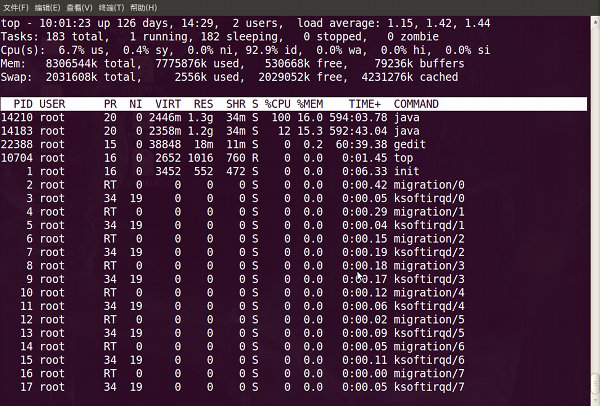

<h1>【教程主题】：进程管理</h1>
<h1>【课程录制】： 创E</h1>
<h1>【主要内容】</h1>
<h2>【1】进程介绍</h2>
<h3>程序和进程</h3>

　　程序是为了完成某种任务而设计的软件，比如OpenOffice是程序。什么是进程呢？进程就是运行中的程序。 
　　一个运行着的程序，可能有多个进程。 比如自学it网所用的WWW服务器是apache服务器，当管理员启动服务后，可能会有好多人来访问，也就是说许多用户来同时请求httpd服务，apache服务器将会创建有多个httpd进程来对其进行服务。

<h3>进程分类；</h3>

　　进程一般分为交互进程、批处理进程和守护进程三类。 
　　值得一提的是守护进程总是活跃的，一般是后台运行，守护进程一般是由系统在开机时通过脚本自动激活启动或超级管理用户root来启动。比如在Redhat中，我们可以定义httpd 服务器的启动脚本的运行级别，此文件位于/etc/init.d目录下，文件名是httpd，/etc/init.d/httpd 就是httpd服务器的守护程序，当把它的运行级别设置为3和5时，当系统启动时，它会跟着启动。

<pre>
[root@localhost ~]# chkconfig  --level 35  httpd on
</pre>  

　　由于守护进程是一直运行着的，所以它所处的状态是等待请求处理任务。比如，我们是不是访问 自学it网 ，自学it网 的httpd服务器都在运行，等待着用户来访问，也就是等待着任务处理。

<h3>进程的属性；</h3>

进程ID（PID)：是唯一的数值，用来区分进程； 
父进程和父进程的ID（PPID)； 
启动进程的用户ID（UID）和所归属的组（GID）； 
进程状态：状态分为运行R、休眠S、僵尸Z； 
进程执行的优先级； 
进程所连接的终端名； 
进程资源占用：比如占用资源大小（内存、CPU占用量）；  

<h3>父进程和子进程；</h3>

　　他们的关系是管理和被管理的关系，当父进程终止时，子进程也随之而终止。 
　　但子进程终止，父进程并不一定终止。比如httpd服务器运行时，我们可以杀掉其子进程，父进程并不会因为子进程的终止而终止。 
在进程管理中，当我们发现占用资源过多，或无法控制的进程时，应该杀死它，以保护系统的稳定安全运行；

<h2>【2】进程管理</h2>

　　对于Linux进程的管理，是通过进程管理工具实现的，比如ps、kill、pgrep等工具；

<h3>ps 监视进程工具</h3>

　　ps 为我们提供了进程的一次性的查看，它所提供的查看结果并不动态连续的；如果想对进程时间监控，应该用top工具；

<h3>ps 的参数说明</h3>

　　ps 提供了很多的选项参数，常用的有以下几个；

<pre>
l  长格式输出；
u  按用户名和启动时间的顺序来显示进程；
j  用任务格式来显示进程；
f  用树形格式来显示进程；
a  显示所有用户的所有进程（包括其它用户）；
x  显示无控制终端的进程；
r  显示运行中的进程；
ww 避免详细参数被截断；
</pre>

我们常用的选项是组合是aux 或lax，还有参数f的应用；

<h3>ps aux 或lax输出的解释；</h3>
<pre>
USER	进程的属主；
PID	进程的ID；
PPID      父进程；
%CPU	进程占用的CPU百分比；
%MEM	占用内存的百分比；
PRI          代表这个程序『可被执行的优先级』
NI	   进程的NICE值，数值大，表示较少占用CPU时间；
VSZ 进程虚拟大小；
RSS  驻留中页的数量；
TTY  终端ID
STAT 进程状态
       D    不间断的睡眠(usually IO)
       R    正在运行中在队列中可过行的； 
       S    处于休眠状态；
       T    停止或被追踪； 
       W    进入内存交换（从内核2.6开始无效）；
       X    死掉的进程（从来没见过）；
       Z    僵尸进程；

<    优先级高的进程 
N    优先级较低的进程 
L    有些页被锁进内存； 
s    进程的领导者（在它之下有子进程）；
l    is multi-threaded (using CLONE_THREAD, like NPTL pthreads do)
+    位于后台的进程组；

WCHAN	正在等待的进程资源；
START     启动进程的时间；
TIME	进程消耗CPU的时间；
COMMAND    命令的名称和参数；
</pre>  
<h3>ps 应用举例；</h3>

实例一：ps aux 最常用

<pre>
[root@localhost ~]# ps -aux | more  
</pre>

可以用 | 管道和 more 连接起来分页查看

<pre>
[root@localhost ~]# ps -aux  > ps001.txt
[root@localhost ~]# more ps001.txt 
</pre>

这里是把所有进程显示出来，并输出到ps001.txt文件，然后再通过more 来分页查看 
实例二：和grep 结合，提取指定程序的进程；  

<pre>
[root@localhost ~]# ps aux | grep httpd
root      4187  0.0  1.3  24236 10272 ?        Ss   11:55   0:00 /usr/sbin/httpd
apache    4189  0.0  0.6  24368  4940 ?        S    11:55   0:00 /usr/sbin/httpd
apache    4190  0.0  0.6  24368  4932 ?        S    11:55   0:00 /usr/sbin/httpd
apache    4191  0.0  0.6  24368  4932 ?        S    11:55   0:00 /usr/sbin/httpd
apache    4192  0.0  0.6  24368  4932 ?        S    11:55   0:00 /usr/sbin/httpd
apache    4193  0.0  0.6  24368  4932 ?        S    11:55   0:00 /usr/sbin/httpd
apache    4194  0.0  0.6  24368  4932 ?        S    11:55   0:00 /usr/sbin/httpd
apache    4195  0.0  0.6  24368  4932 ?        S    11:55   0:00 /usr/sbin/httpd
apache    4196  0.0  0.6  24368  4932 ?        S    11:55   0:00 /usr/sbin/httpd
root      4480  0.0  0.0   5160   708 pts/3    R+   12:20   0:00 grep httpd
</pre>

实例二：父进和子进程的关系友好判断的例子

<pre>
[root@localhost ~]# ps auxf  | grep httpd
root      4484  0.0  0.0   5160   704 pts/3    S+   12:21   0:00              \_ grep httpd
root      4187  0.0  1.3  24236 10272 ?        Ss   11:55   0:00 /usr/sbin/httpd
apache    4189  0.0  0.6  24368  4940 ?        S    11:55   0:00  \_ /usr/sbin/httpd
apache    4190  0.0  0.6  24368  4932 ?        S    11:55   0:00  \_ /usr/sbin/httpd
apache    4191  0.0  0.6  24368  4932 ?        S    11:55   0:00  \_ /usr/sbin/httpd
apache    4192  0.0  0.6  24368  4932 ?        S    11:55   0:00  \_ /usr/sbin/httpd
apache    4193  0.0  0.6  24368  4932 ?        S    11:55   0:00  \_ /usr/sbin/httpd
apache    4194  0.0  0.6  24368  4932 ?        S    11:55   0:00  \_ /usr/sbin/httpd
apache    4195  0.0  0.6  24368  4932 ?        S    11:55   0:00  \_ /usr/sbin/httpd
apache    4196  0.0  0.6  24368  4932 ?        S    11:55   0:00  \_ /usr/sbin/httpd
</pre>

这里用到了f参数；父与子关系一目了然；

<h3>pgrep</h3>

　　pgrep 是通过程序的名字来查询进程的工具，一般是用来判断程序是否正在运行。在服务器的配置和管理中，这个工具常被应用，简单明了；

<h4>用法：</h4>
<pre>#pgrep 参数选项   程序名</pre>
<h4>常用参数</h4>
<pre><code>-l  列出程序名和进程ID；
-o  进程起始的ID；
-n  进程终止的ID；
</code></pre>

<h4>举例：</h4>
<pre>
[root@localhost ~]# pgrep -lo httpd
4557 httpd

[root@localhost ~]# pgrep -ln httpd
4566 httpd

[root@localhost ~]# pgrep -l httpd
4557 httpd
4560 httpd
4561 httpd
4562 httpd
4563 httpd
4564 httpd
4565 httpd
4566 httpd

[root@localhost ~]# pgrep httpd
4557
4560
4561
4562
4563
4564
4565
4566
</pre>
<h3>终止进程的工具 kill 、killall、pkill</h3>

　　终止一个进程或终止一个正在运行的程序，一般是通过 kill 、killall、pkill、xkill 等进行。比如一个程序已经死掉，但又不能退出，这时就应该考虑应用这些工具。 
　　另外应用的场合就是在服务器管理中，在不涉及数据库服务器程序的父进程的停止运行，也可以用这些工具来终止。为什么数据库服务器的父进程不能用这些工具杀死呢？原因很简单，这些工具在强行终止数据库服务器时，会让数据库产生更多的文件碎片，当碎片达到一定程度的时候，数据库就有崩溃的危险。比如mysql服务器最好是按其正常的程序关闭，而不是用pkill mysqld 或killall mysqld 这样危险的动作；当然对于占用资源过多的数据库子进程，我们应该用kill 来杀掉。

<h4>kill</h4>

kill的应用是和ps 或pgrep 命令结合在一起使用的；

<h5>kill 的用法：</h5>
<pre><code>kill ［信号代码］   进程ID 
</code></pre>

<blockquote>

注：信号代码可以省略；我们常用的信号代码是 -9 ，表示强制终止；  

</blockquote>
<h5>举例：</h5>
<pre>
[root@localhost ~]# ps  auxf  |grep   httpd
root      4939  0.0  0.0   5160   708 pts/3    S+   13:10   0:00              \_ grep httpd
root      4830  0.1  1.3  24232 10272 ?        Ss   13:02   0:00 /usr/sbin/httpd
apache    4833  0.0  0.6  24364  4932 ?        S    13:02   0:00  \_ /usr/sbin/httpd
apache    4834  0.0  0.6  24364  4928 ?        S    13:02   0:00  \_ /usr/sbin/httpd
apache    4835  0.0  0.6  24364  4928 ?        S    13:02   0:00  \_ /usr/sbin/httpd
apache    4836  0.0  0.6  24364  4928 ?        S    13:02   0:00  \_ /usr/sbin/httpd
apache    4837  0.0  0.6  24364  4928 ?        S    13:02   0:00  \_ /usr/sbin/httpd
apache    4838  0.0  0.6  24364  4928 ?        S    13:02   0:00  \_ /usr/sbin/httpd
apache    4839  0.0  0.6  24364  4928 ?        S    13:02   0:00  \_ /usr/sbin/httpd
apache    4840  0.0  0.6  24364  4928 ?        S    13:02   0:00  \_ /usr/sbin/httpd
</pre>

我们查看httpd 服务器的进程；您也可以用pgrep -l httpd 来查看； 
我们看上面例子中的第二列，就是进程PID的列，其中4830是httpd服务器的父进程，从4833－4840的进程都是它4830的子进程；如果我们杀掉父进程4830的话，其下的子进程也会跟着死掉；

<pre>
[root@localhost ~]# kill 4840  注：杀掉4840这个进程；

[root@localhost ~]# ps -auxf  |grep  httpd  注：查看一下会有什么结果？是不是httpd服务器仍在运行？
[root@localhost ~]# kill 4830   注：杀掉httpd的父进程；
[root@localhost ~]# ps -aux |grep httpd  注：查看httpd的其它子进程是否存在，httpd服务器是否仍在运行？
</pre>
<blockquote>

对于僵尸进程，可以用kill -9 来强制终止退出；  

</blockquote>

比如一个程序已经彻底死掉，如果kill 不加信号强度是没有办法退出，最好的办法就是加信号强度 -9 ，后面要接杀父进程；比如；

<pre>
[root@localhost ~]# ps aux |grep gaim
beinan    5031  9.0  2.3 104996 17484 ?        S    13:23   0:01 gaim
root      5036  0.0  0.0   5160   724 pts/3    S+   13:24   0:00 grep gaim

或

[root@localhost ~]# pgrep -l gaim
5031 gaim
[root@localhost ~]# kill -9 5031
</pre>
<h4>3.2 killall</h4>

killall 通过程序的名字，直接杀死所有进程，咱们简单说一下就行了。

<h5>用法：killall 正在运行的程序名</h5>

killall 也和ps或pgrep 结合使用，比较方便；通过ps或pgrep 来查看哪些程序在运行；

<h5>举例：</h5>
<pre>
[root@localhost beinan]# pgrep -l gaim
2979 gaim

[root@localhost beinan]# killall gaim
</pre>
<h4>3.3 pkill</h4>

pkill 和killall 应用方法差不多，也是直接杀死运行中的程序；如果您想杀掉单个进程，请用kill 来杀掉。

<h5>应用方法：</h5>
<pre>
#pkill  正在运行的程序名
</pre>
<h5>举例：</h5>
<pre>
[root@localhost beinan]# pgrep -l gaim
2979 gaim

[root@localhost beinan]# pkill gaim
</pre>
<h4>top 监视系统任务的工具；</h4>

和ps 相比，top是动态监视系统任务的工具，top 输出的结果是连续的；

<h5>top 命令用法及参数；</h5>
<h6>top 调用方法：</h6>
<pre><code>top 选择参数
</code></pre>

<h6>参数：</h6>
<pre>
-b  以批量模式运行，但不能接受命令行输入；
-c 显示命令行，而不仅仅是命令名；
-d N  显示两次刷新时间的间隔，比如 -d 5，表示两次刷新间隔为5秒；
-i 禁止显示空闲进程或僵尸进程；
-n NUM  显示更新次数，然后退出。比如 -n 5，表示top更新5次数据就退出；
-p PID 仅监视指定进程的ID；PID是一个数值；
-q  不经任何延时就刷新；
-s  安全模式运行，禁用一些效互指令；
-S 累积模式，输出每个进程的总的CPU时间，包括已死的子进程；
</pre>
<h6>交互式命令键位：</h6>
<pre>
space  立即更新；
c 切换到命令名显示，或显示整个命令（包括参数）；
f,F 增加显示字段，或删除显示字段；
h,? 显示有关安全模式及累积模式的帮助信息；
k 提示输入要杀死的进程ID，目的是用来杀死该进程（默人信号为15）
i 禁止空闲进程和僵尸进程；
l 切换到显法负载平均值和正常运行的时间等信息；
m 切换到内存信息，并以内存占用大小排序；
n  提示显示的进程数，比如输入3，就在整屏上显示3个进程；
o,O 改变显示字段的顺序；
r 把renice 应用到一个进程，提示输入PID和renice的值；
s 改变两次刷新时间间隔，以秒为单位；
t 切换到显示进程和CPU状态的信息；
A 按进程生命大小进行排序，最新进程显示在最前；
M 按内存占用大小排序，由大到小；
N 以进程ID大小排序，由大到小；
P 按CPU占用情况排序，由大到小
S 切换到累积时间模式；
T  按时间／累积时间对任务排序；
W 把当前的配置写到~/.toprc中；
</pre>
<h5>top 应用举例；</h5>
<pre><code>[root@localhost ~]# top  
</code></pre>

然后根据前面所说交互命令按个尝试一下就明白了，比如按M，就按内存占用大小排序 
当然您可以把top的输出传到一个文件中；  

<pre>
[root@localhost ~]# top > mytop.txt
</pre>

然后我们就可以查看mytop文件，以慢慢的分析系统进程状态； 
 
 　　此图是刚进入top的基本视图，我们来结合这个视图讲解各个数据的含义。 
第一行：

<pre>
10:01:23 — 当前系统时间
126 days, 14:29 — 系统已经运行了126天14小时29分钟（在这期间没有重启过）
2 users — 当前有2个用户登录系统
load average: 1.15, 1.42, 1.44 — load average后面的三个数分别是1分钟、5分钟、15分钟的负载情况。
load average数据是每隔5秒钟检查一次活跃的进程数，然后按特定算法计算出的数值。
            如果这个数除以逻辑CPU的数量，结果高于5的时候就表明系统在超负荷运转了。
</pre>

第二行：

<pre>
Tasks — 任务（进程），
        系统现在共有183个进程，
其中处于运行中的有1个，182个在休眠（sleep），stoped状态的有0个，zombie状态（僵尸）的有0个。
</pre>

第三行：cpu状态

<pre>
6.7% us — 用户空间占用CPU的百分比。
0.4% sy — 内核空间占用CPU的百分比。
0.0% ni — 改变过优先级的进程占用CPU的百分比
92.9% id — 空闲CPU百分比
0.0% wa — IO等待占用CPU的百分比
0.0% hi — 硬中断（Hardware IRQ）占用CPU的百分比
0.0% si — 软中断（Software Interrupts）占用CPU的百分比
在这里CPU的使用比率和windows概念不同，如果你不理解用户空间和内核空间，需要充充电了。
</pre>

第四行：内存状态

<pre>
8306544k total — 物理内存总量（8GB）
7775876k used — 使用中的内存总量（7.7GB）
530668k free — 空闲内存总量（530M）
79236k buffers — 缓存的内存量 （79M）
</pre>

第五行：swap交换分区

<pre>
2031608k total — 交换区总量（2GB）
2556k used — 使用的交换区总量（2.5M）
2029052k free — 空闲交换区总量（2GB）
4231276k cached — 缓冲的交换区总量（4GB）
    这里要说明的是不能用windows的内存概念理解这些数据，如果按windows的方式此台服务器“危矣”：8G的内存总量只剩下530M的可用内存。
Linux的内存管理有其特殊性，复杂点需要一本书来说明，这里只是简单说点和我们传统概念（windows）的不同。
    第四行中使用中的内存总量（used）指的是现在系统内核控制的内存数，空闲内存总量（free）是内核还未纳入其管控范围的数量。
纳入内核管理的内存不见得都在使用中，还包括过去使用过的现在可以被重复利用的内存，内核并不把这些可被重新使用的内存交还到free中去，
因此在linux上free内存会越来越少，但不用为此担心。
    如果出于习惯去计算可用内存数，这里有个近似的计算公式：第四行的free + 第四行的buffers + 第五行的cached，
按这个公式此台服务器的可用内存：530668+79236+4231276 = 4.7GB。
    对于内存监控，在top里我们要时刻监控第五行swap交换分区的used，
如果这个数值在不断的变化，说明内核在不断进行内存和swap的数据交换，这是真正的内存不够用了。
</pre>

第六行是空行

第七行以下：各进程（任务）的状态监控

<pre>
PID — 进程id
USER — 进程所有者
PR — 进程优先级
NI — nice值。负值表示高优先级，正值表示低优先级
VIRT — 进程使用的虚拟内存总量，单位kb。VIRT=SWAP+RES
RES — 进程使用的、未被换出的物理内存大小，单位kb。RES=CODE+DATA
SHR — 共享内存大小，单位kb
S — 进程状态。D=不可中断的睡眠状态 R=运行 S=睡眠 T=跟踪/停止 Z=僵尸进程
%CPU — 上次更新到现在的CPU时间占用百分比
%MEM — 进程使用的物理内存百分比
TIME+ — 进程使用的CPU时间总计，单位1/100秒
COMMAND — 进程名称（命令名/命令行）
</pre>