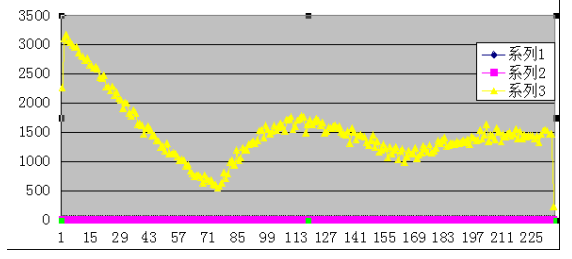
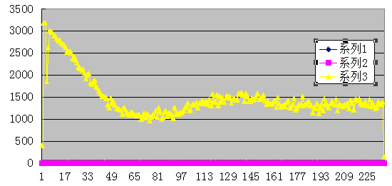

MySQL周期性波动试验  
实验目的: 模拟数据库高低峰时的压力波动,并会观察绘制波动曲线  
实验思路: 反复查询数据库并缓存入memcached, 缓存定期失效,  
观察记录服务器参数,并作图表.

实验准备: nginx+php+memcached+awk+ab  
1: index.php  (随机访问3W条热数据,并储存在memcached中  
2: memcached (储存查询结果)  
3: ab 压力测试工具  
4: awk脚本 

编译PHP-memcache扩展 (此步骤适合任意PHP扩展)  
以memcache-2.2.7为例(注意,这是PHP连接memcached的一个扩展)  
解压后,假设路径/path/to/memcache  
<pre>
step1 : /path/to/memcached/# /path/to/php/bin/phpize #作用是根据PHP的版本生成编译文件  
此步骤后,memcache目录下,产生configure文件
step2: configure --with-php-config =/path/to/php/bin/php-config
step3: make && make install
此步骤编译出一个memcache.so文件
step4: 修改php.ini引入memcache.so
</pre>
实验步骤:   
总数据3W以上,50个并发,每秒请求500-1000次  
请求结果缓存在memcache,生命周期为60秒,  
(生命周期要结合请求周期来制定,比如3万条数据随机,每秒1000条,30秒能走一遍,生命周期可设为60秒)  
观察mysql连接数,每秒请求数的周期变化.   
  
  

看上图,mysql的每秒请求数,随着缓存失效,有短时间的高峰.  

解决办法:   
1: 减少无关请求(业务逻辑层面,暂不讨论,但其实是最有效的手段)   
2: 如果请求数是一定的,不可减少的. 我们要尽量让请求数平稳,不要有剧烈波动.  
很多时候,不是服务器撑不住总的查询量,而是在某个时间段撑不住高峰请求.  

该实际问题最后的解决:  
  
  

----夜间负载低时,集中失效.   
短时间内会有波峰,但夜间访问量少,因此波峰并不剧烈,当到上午10点左右人多时,缓存已经建立了一部分. 白天时,波峰也不剧烈.   

或者让缓存的生命周期在一定范围内随机,也可以减缓波峰剧烈的情况  
我们把实验中的生命周期由80秒,改为[40-120秒],其他实验条件不变.  
得到如下曲线  

  

可以看出,稳定运行后,请求在[1000-1500]之间波动,  

而固定缓存周期是,请求在[500-1700]之间波动.

实验附件:  
bench.php
<pre>
// 30K hot news
$rangeid = rand(1,30000)+13000000;

$mconn = memcache_connect('localhost',11211);

if( ($com = memcache_get($mconn,$rangeid)) === false) {
 $conn = mysql_connect('localhost','root');

 $sql = 'use bigdata';
 mysql_query($sql,$conn);

 $sql = 'set names utf8';
 mysql_query($sql,$conn);
 $sql = 'select id,name,brief from lx_com where id=' . $rangeid;

 $rs = mysql_query($sql,$conn);
 $com = mysql_fetch_assoc($rs);

 memcache_add($mconn , $rangeid , $com , false, mt_rand(40,120));
} else {
  echo 'from cache';
}
print_r($com);

</pre>

status.sh
<pre>
#!/bin/bash
while true
do
mysqladmin -uroot ext|awk '/Queries/{q=$4}/Threads_connected/{c=$4}/Threads_running/{r=$4}END{printf("%d %d %d\n",q,c,r)}' >> status.txt
sleep 1
done

</pre>	
