
生活中的常识: 记账.
账:就是数据/信息,
记账--&gt;就是储存数据/信息

生活中,账一般记在哪儿呢?
比如:账本上, 门上,墙上.日历上.

问上:10/12,老孙头借豆种50斤

无论记在哪儿: 记录的都是信息, 变化的只是信息的载体.

随着现代社会数据的急剧增多,我们用更高效的记录信息的方式.

  

来一个班级学生档案
姓名,年龄,家乡        
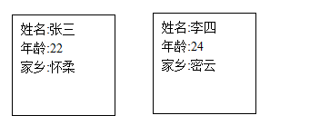  
60个学生,就需要60个纸片, 而且这60个纸片,上面字有重复的. 姓名/年龄/家乡
信息有冗余,想个办法更让信息更有条理.

<table>
	<tr>
		<th>姓名</th>
		<th>年龄</th>
		<th>家乡</th>
	</tr>
	<tr>
		<td>张三</td>
		<td>22</td>
		<td>怀柔</td>
	</tr>
	<tr>
		<td>李四</td>
		<td>24</td>
		<td>密云</td>
	</tr>
</table> 

好处:再多一个学生的话,只需要添加一行数据, 姓名/年龄/家乡不用重写了. 
班级要考试,考试成绩,也要记录起来

<table>
	<tr>
		<th>姓名</th>
		<th>科目</th>
		<th>成绩</th>
	</tr>
	<tr>
		<td>张三</td>
		<td>语文</td>
		<td>68</td>
	</tr>
	<tr>
		<td>李四</td>
		<td>思想品德</td>
		<td>23</td>
	</tr>
</table> 

现在这一个班级里, 有档案表/成绩表/违纪表/就业登记表....... 
这些表,都是用来管理公益1期班的信息用的.  

因此,这些表,放在一个档案袋里-------档案袋是 数据库  

公益1期有档案袋(库1), 公益2期有档案袋(库2) -----&gt; 交给王大婶子来管理 
王大婶管理着 许多库, 我们想要数据时,找王大婶. 
王大婶子 --&gt;数据库服务器 
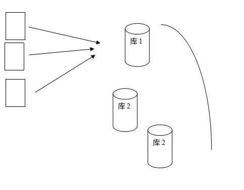 
一台服务器下有多个库,一个库下有1到多张表, 表有多行多列的数据. 
作为WEB开发程序员, 和表的操作相对多.   

<h5>数据库服务器是不是mysql呢?</h5>

答: 对于数据库存储数据来说,国际上有sql标准. 
如:列类型,sql语法等是有ISO标准的. 
很多软件开发商,遵守sql标准,来开发一套软件,用来储存和管理数据. 
这套软件,就可以称为数据库管理系统.  

就好比说,看网页可以用 firefox,IE,chrome, 
管理数据呢,可以用mysql, oracle,IBM DB2, sqlite, postgresql 
这些软件都能够用来管理数据.  

<h5>数据库大体上要遵循sql标准,但未必100%遵循.</h5>

答:不是的,各厂商的产品可能对sql标准的执行有微小差异. 
比如 mysql就没有全连接 full join, 没有sql server中的 top N这种用法 
就好像,html有w3c标准来约束,但各浏览器也有解析不兼容的地方,但是少数.  

<h5>为什么要先用mysql来学习?</h5>

答: 
1:mysql和linux php,apache,配合紧密,LAMP架构. 
2:mysql开源,免费.  

<h5>请同学们有时间也可以关注一下postgresql</h5>

答:postgresql也是一个开源数据库,而且sql标准执行方面,比mysql要严格. 
Mysql--&gt;卖给-&gt;sun--&gt;oracle, 版权开源方面前途未卜.  

安装Mysql,装哪一个版本? 
答:对于软件,尤其是开源软件,不要追求最新的版本. 
往往最新的版本,意味着bug多,新用户往往成了&quot;小白鼠&quot;  

开源软件的版本,一般会有beta版,stable版.
我们尽量选用稳定版.

目前,比较稳定的2个版本,mysql5.1, mysql5.5

连接数据库:以命令行连接为例:
注意:如果在命令提示下,出现如下提示: 
 

  
则说明:没有配置环境变量,导致系统找不到mysql.exe. 
解决: 
1:配置环境变量,指定mysql\bin目录 
2:每次进入到mysql\bin目录,再运行mysql 
3: 如何连接服务器
   服务器地址( 可用IP,域名) : 端口(3306)
   用户名
   密码
Mysql -h localhost -uUserName -pPassWd
-h 如果不写,则默认连localhost

如果看到下面的图标 
 
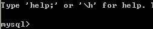
  
则说明连接服务器成功了.

<h5>澄清一个概念</h5>

连接成功后,:命令行黑窗口  和  mysql服务器是什么关系? 
答: 客户端 client --&gt; 服务端 server的关系.  

就好像 你的浏览器与---&gt;163网站的服务器的关系一样.  

还有没有其他mysql客户端? 
答:有,navcat,mysqlfront,phpMyAdmin,SQLyogEnt 
入门最基本语句  

当连上服务器后,我们首先面对的是? 
答:是库,库有1个或多个,因此我们要想对表/行做操作的话,得先选库.  

查看一下所有的库,怎么办?
Mysql&gt;Show databases;

<h5>选库语句: Use 库名</h5>

 
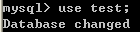
   

<h5>创建一个数据库: create database 数据库名 [charset 字符集]</h5>

 
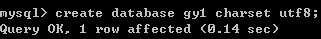
   

<h5>删除一个数据库: drop database 数据库名;</h5>

 
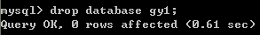
   

<h5>把数据库改改名?</h5>

Mysql中,表/列可以改名,database不能改名. 
phpMyAdmin似乎有这功能? 他是建新库,把所有表复制到新库,再删旧库完成的.

当选了库之后,我们面对的是表

<h5>查看库下面的所有表: show  tables;</h5>

先给大家提供一个简单的建表语句,供练习用

<pre>
create table stu (
snum int,
sname varchar(10)
)engine myisam charset utf8;
/// engine是指表引擎,和性能特点相关,此处先照抄.
</pre>
<h5>删除表: drop table stu;</h5>
<h5>修改表名:</h5>

 
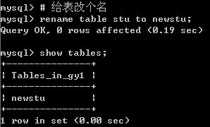 
 

<h5>清空表数据: truncate 表名</h5>

 
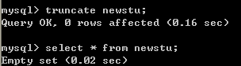
   

<h5>Truncate和delete是有区别的,</h5>
<pre>
在于 truncate相当于删表再重建一张同样结构的表,操作后得到一张全新表.
而delete是从删除所有的层面来操作的.
Trucate相当于把旧的学籍表扔了重画一张,
Delete相当于用橡皮把学籍表的数据库擦掉.
如果决定全清空的下,truncate速度更快一些.
</pre>

查看表结构
答: desc tableName; //查看表结构   

<table>
	<tr>
		<td width="100">Id</td>
		<td width="100">title</td>
	</tr>
</table>  
<h4>12: 解决字符集问题:</h4>

默认建表一般用utf8, 而我们在windows下窗口是GBK的,
因此,需要声明字符集.

<pre>
Set names gbk;
</pre>
<blockquote>

发现的1小问题  
语句打错以后应该退出本语句,再继续打新语句.也可以打\c,退出本语句.

</blockquote>
<h5>如何破解数据库的密码:</h5>
<pre>
1:通过任务管理器或者服务管理,关掉mysqld(服务进程)
2:通过命令行+特殊参数开启mysqld
Mysqld --skip-grant-tables
3:此时,mysqld服务进程已经打开,并且,不需要权限检查.
4:mysql -uroot  无密码登陆服务器.
5: 修改权限表
  A: use mysql;
  B:update user set Password = password('11111') where User = 'root';
  C:flush privileges;

6:通过任务管理器,或服务管理,关掉mysqld服务进程.
7:再次通过服务管理,打开mysql服务.
即可用修改后的新密码登陆.
</pre>
<h5>增删改查基本语法学习</h5>

增: insert 
Insert 3问:  
1. 插入哪张表?  
2. 插入哪几列? 
3. 这几列分别插入什么值?  

<pre>
Insert into TableName
(列1,列2.... 列n)
Values
(值1,值2,....值n)
</pre>
<blockquote>

值 与 列,按顺序,一一对应

特殊: insert语句 允不允许不写列名
答: 允许. 
如果没有声明列明,则默认插入所有列. 
因此,值应该与全部列,按顺序一一对应.  

</blockquote>
<h5>例:建一张工资登记表</h5>

 
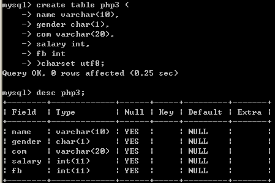
  
2:插入部分列 
 
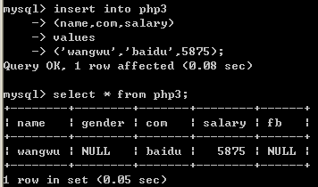
  
3:插入所有列 
 

   

<blockquote>

注:文中的set names gbk;是为了告诉服务器,客户端用的GBK编码,防止乱码.  

</blockquote>

4:插入所有的列的简单写法. 
  
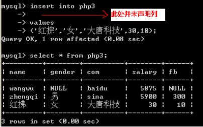
  

<h4>改: Update 语句</h4>

Update 4问 
改哪张表? 
改哪几列的值? 
分别改为什么值? 
在哪些行生效?  

语法:

<pre>
Update 表名 
Set 
列1 = 新值 1,
列2 = 新值2,
列n = 新值n.....
Where  expr
</pre>

例: 
  
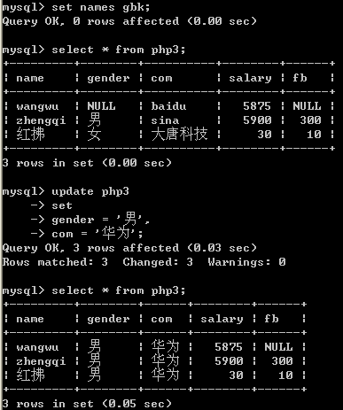
    

<h4>删除: delete</h4>

Delete 2问 
从哪张表删除数据? 
要删除哪些行?  

语法:

<pre>
Delete from 表名 where  expr
</pre>

例:
  
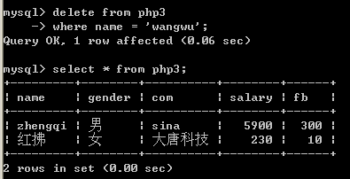
   

<h4>查: select</h4>

查询3问 
1:查哪张表的数据? 
2:查哪些列的数据? 
3:查哪些行的数据?  

语法:

<pre>
Select 列1, 列2, 列3,...列n
From 表名
Where expr;
</pre>

 
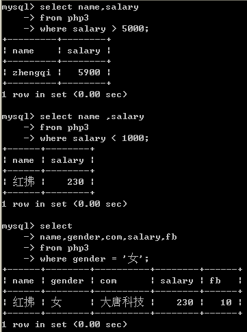
   

<blockquote>

注: 如果取一张表的所有列, 可以用 * 代替所有列

</blockquote>

 
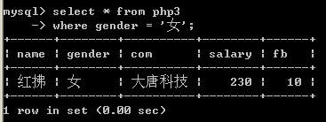
   

<h4>怎么建表?</h4>

以在A4纸上建表为例, 
 
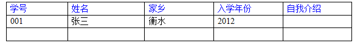
   
分析:我们只要把第一行,表头建好了,这张表也就完成了. 
至于下面的001,张三,这不是表的概念,而是表中储存的数据.  

其实,建表过程,就是一个画表头的过程, 
从术语上讲,这张表有5个列, 
建表的过程,就是一个 声明字段 过程  

<h5>那么建表和列类型又有什么关系呢?</h5>

分析: 再看上面的表,A4纸是数据的存储空间,而A4的大小是有限的. 
请问:你准备给学号留多宽? 给姓名留多宽? 自我介绍又留多宽?  

自然的, 姓名如果留的过宽,比如20个字都能存,但是一般人的姓名,就三四字---浪费了. 
如果留的过窄,导致存不下,更有问题.  

对应的,A4纸空间有限,硬盘空间也有限, 
我们建列时,自然想的是------能够容纳放置的内容,但是又不浪费.  

<blockquote>

存储同样的数据,不同的列类型,所占据的空间和效率是不一样的--这就是我们建表前要前列类型的意义. 
所以---重点学列类型的存储范围与占据的字节关系.

</blockquote>
<h4>列类型学习</h4>

mysql三大列类型 
数值型  

<h5>整型</h5>
<pre>
Tinyint/ smallint/ mediumint/int/ bigint(M) unsigned zerofill
</pre>

整型系列所占字节与存储范围的关系. 
定性: 占字节越多,存储范围越大. 
下图: 是具体的数字分析  

<pre>
Tinyint 1个字节 8个位  0 - 2^8-1  ,  0-255
                -2^7 ----> +2^7-1

分析:
Smallint 2个字节 , 16位  0----2^16-1 = 65535
                -2^15 ---> +2^15-1, -32768 -> 32767

一般而言,设某类型 N字节
N字节 , 8N位.
0 ----> 2^8N-1

-2^(8N-1)  ---> +2^(8N-1) -1; 

对于int型 : 占的字节越多,存储的范围也越大.
</pre>

 
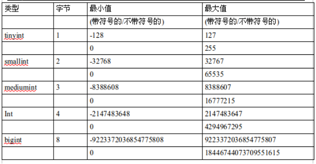
    
整型系统的可选参数 : XXint(M)  unsigned zerofill

<pre>
例: age tinyint(4) unsigned ,或者  stunum smallint(6) zerofill;
Unsigned: 代表此列为无符号类型, 会影响到列的存储范围. (范围从0开始)
(不加unsinged, 则该列默认是有符号类型,范围从负数开始)

Zerofill: 代表0填充, 即: 如果该数字不足参数M位, 则自动补0, 补够M位.
1: 如果没有zerofill属性, 单独的参数M,没有任何意义.
2:如果设置某列为zerofill,则该列已经默认为 unsigned,无符号类型.
</pre>
<h5>小数型</h5>
<pre>
Float(M,D),decimal(M,D)  
M叫"精度" ---->代表"总位数",而D是"标度",代表小数位.(小数右边的位数)  

浮点数占多大的空间呢  
答：　float　能存10＾３８　，10^-38  
如果M<=24, 点4个字节,否则占8字节  

用来表示数据中的小数,除了float---浮点.  
还有一种叫定点decimal,定点是把整数部分, 和小数部分,分开存储的.  
比float精确,他的长度是变化的.  

空间上的区别:  
Float(M,D), M<=24, 4个字节, 24 <M <=53, 8个字节
Decimal () ,变长字节.

区别: decimal比float精度更高, 适合存储货币等要求精确的数字,
</pre>

见下例: 
 
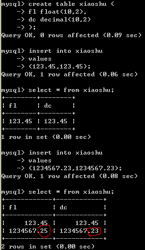
    

<h5>字符串型</h5>

Char(M) 
Varchar(M) 
Text 文本类型  

<h5>日期时间类型</h5>

Date 日期 
Time 时间 
Datetime 时间时间类型 
Year 年类型  

<h5>Mysql 字符串类型</h5>

Char 定长类型 
Char(M)  , M 代表宽度, 0&lt;=M&lt;=255之间 
例:Char(10)  ,则能输入10个字符.  

Varchar 变长类型 
Varchar(M), M代表宽度, 0&lt;=M&lt;=65535(以ascii字符为例,utf822000左右)  

类型 
 
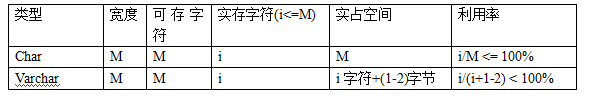
   
0000000000 
00\0\0\0\0\0 (char型,如果不够M个字符,内部用空格补齐,取出时再把右侧空格删掉)   
注:这意味着,如果右侧本身有空格,将会丢失.  

Varchar(10) 
[2]张三 
[3]二麻子 
[4]司马相如  

Char(8) 
00000000 
'Hello   ' 
'hello ' 
Char(M)如何占据M个字符宽度? 
答: 如果实际存储内容不足M个,则后面加空格补齐. 
取出来的时候, 再把后面的空格去掉.(所以,如果内容最后有空格,将会被清除).  

速度上: 定长速度快些  

注意: char(M),varchar(M)限制的是字符,不是字节. 
即 char(2) charset utf8, 能存2个utf8字符. 比如'中国'char与varchar型的选择原则: 
1:空间利用效率, 四字成语表, char(4),  
个人简介,微博140字, varchar(140) 
2:速度 
用户名: char  

Char 与 varchar相关实验  
 
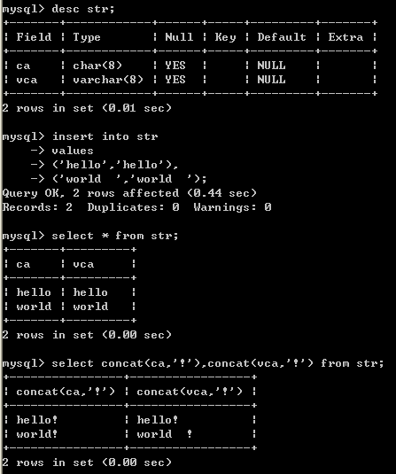
     

Text : 文本类型,可以存比较大的文本段,搜索速度稍慢.  

<pre>
因此,如果不是特别大的内容,建议用char,varchar来代替.  
Text 不用加默认值 (加了也没用).  
</pre>

Blob,是二进制类型,用来存储图像,音频等二进制信息. 

<pre>
意义: 2进制,0-255都有可能出现.   
Blob在于防止因为字符集的问题,导致信息丢失.   
比如:一张图片中有0xFF字节, 这个在ascii字符集认为非法,在入库的时候,被过滤了.  
</pre>

日期时间类型 

<pre>
Year 年(1字节)    95/1995,  [1901-2155],  
在insert时,可以简写年的后2位,但是不推荐这样.  
[00-69] +2000  
[70-99] + 1900,     
即: 填2位,表示 1970 - 2069  
</pre>

Date 日期  1998-12-31

<pre>
范围: 1000/01/01 ,9999/12/31
</pre>  

Time 时间  13:56:23

<pre>
范围: -838:59:59 -->838:59:59
</pre>

datetime 时期时间  1998-12-31 13:56:23

<pre>
范围: 1000/01//01 00:00:00  ---> 9999:12:31 23:59:59
</pre>

timestamp

<pre>
时间戳: 
是1970-01-01 00:00:00 到当前的秒数. 
一般存注册时间,商品发布时间等,并不是用datetime存储,而是用时间戳.
因为datetime虽然直观,但计算不便.
</pre>

建表案例,某高端白领私密社交网站

定长与变长分离
常用与不常用列分离
 
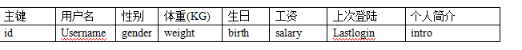
 
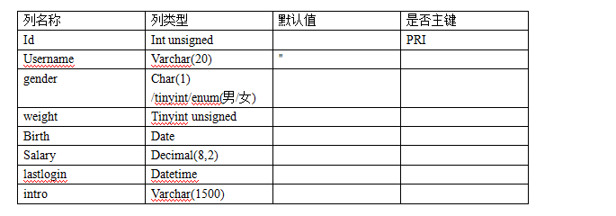
 
这张表不够好,可以优化 
分析:这张表除了username/intro列之外,每一列都是定长的. 
我们不妨让其所有列,都定长,可以极大提高查询速度. 
 
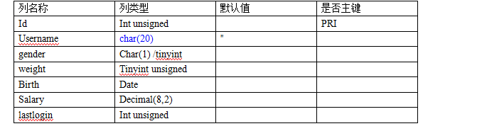
 
Username char(10) 是会造成空间的浪费,但是提高的速度,值. 
Intro char(1500) 却浪费的太多了,另一方面,人的简介,一旦注册完,改的频率也并不高. 
我们可以把 intro列单独拿出来,另放一张表里.
 
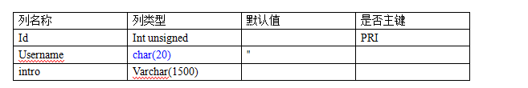
  
在开发中,会员的信息优化往往是 把频繁用到的信息,优先考虑效率,存储到一张表中. 
不常用的信息和比较占据空间的信息,优先考虑空间占用,存储到辅表中. 
建表语法  

<pre>
所谓建表就是一个声明列的过程.
create table 表名 (
列名1 列类型1  列1参数,
列名2 列类型2 列2参数,
....
...
列名n 列类型n 列n参数
)engine myisam/innodb/bdb charset utf8/gbk/latin1...
</pre>
<h4>修改表的语法</h4>

一张表,创建完毕,有了N列. 
之后还有可能要增加或删除或修改列   

Alter table 表名 add 列名称 列类型 列参数;  [加的列在表的最后]
例: alter table m1 add birth date not null default '0000-00-00';
Alter table 表名 add 列名称 列类型 列参数 after 某列 [把新列加在某列后]
例: alter table m1 add gender char(1) not null default '' after username;

Alter table 表名 add 列名称 列类型 列参数 first [把新列加在最前面]
例: alter table m1 add pid int not null default 0 first;

删除列:
Alter table 表名  drop 列名

修改列类型:

<pre>
Alter table 表名 modify 列名 新类型  新参数
例:alter table m1 modify gender char(4) not null default '';
</pre>

修改列名及列类型

<pre>
Alter table 表名 change 旧列名 新列名 新类型 新参数
例:alter table m1 change id uid int unsigned;
</pre>
<blockquote>

作业: 让我们建一个电子商城, 如何来设计商品表. 
再把商城表的字段,一个个删掉,再一个个加上. 
并穿插改列操作.  

</blockquote>
<h5>??如果列类型改变了,导致数据存不下怎么办?</h5>

比如,int 改成smallint列.   如果不匹配,数据将会丢失,或者在mysql的strict_mode下,修改不了.

<h5>为什么建表时,加not null default '' / default 0</h5>

答:不想让表中出现null值.

<h5>为什么不想要的null的值</h5>

答:
不好比较,null是一种类型,比较时,只能用专门的is null 和 is not null来比较. 
碰到运算符,一律返回null
效率不高,影响提高索引效果.  

因此,我们往往,在建表时 not null default ''/0  

<h4>Select 5种子句详解</h4>
<h5>1:where子句  条件查询</h5>
<pre>
查出一张表的所有行,所有列
Select * from tableName;

查出一张表的所有行,部分列.
Select id,name,salary from tableName

查出一张表的所有列,部分行(id >=2 的行)
Select * from tableName where id >=2;
</pre>
<h5>模糊查询:</h5>
<pre>
案例:想查找"诺基亚"开头的所有商品
Like->像

% --> 通配任意字符
'_' --> 单个字符
</pre>
<h5>查询模型(重要)</h5>

列就是变量,在每一行上,列的值都在变化. 
Where条件是表达式,在哪一行上表达式为真, 
哪一行就取出来 
比如下面的条件, shop<em>price在不同的行,有不同的值. 
在哪一行时,shop</em>price&gt;5000如果为真,则这行取出来. 
 

  
查询结果集--在结构上可以当成表看

<pre>
select count(*) from 表名, 查询的就是绝对的行数,哪怕某一行所有字段全为NULL,也计算在内.
而select couht(列名) from 表名,
查询的是该列不为null的所有行的行数.

用count(*),count(1),谁好呢?
其实,对于myisam引擎的表,没有区别的.
这种引擎内部有一计数器在维护着行数.
Innodb的表,用count(*)直接读行数,效率很低,因为innodb真的要去数一遍.
</pre>
<h5>Group</h5>

 
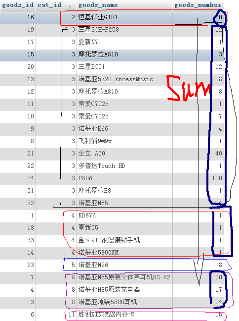
  
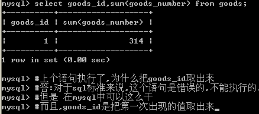
   

<blockquote>

思考: 
全班同学排队, 
校长对老师说: 统计班级同学的姓名和平均年龄[返回1行] 
语义上的疑问: 平均年龄好算,只有一个结果,但是,把谁的姓名和平均年龄放在一块返回呢? 
语义上就解释不通,但是mysql中却偏偏可以取姓名,而且是把队伍的第一位同学的姓名返回. 
这是mysql的一个特点,出于可移植性和规范性,不推荐这么写. 
严格的讲,以group by  a,b,c 为列,则select的列,只能在a,b,c里选择,语义上才没有矛盾.  

</blockquote>
<h5>having</h5>
<h5>Order by</h5>
<pre>
当最终结果集出来后,可以进行排序.
排序的语法:
Order by 结果集中的列名 desc/asc

例:order by shop_price desc ,按价格降序排列
Order by add_time asc ,按发布时间升序排列.

多字段排序也很容易
Order by 列1 desc/asc , 列2 desc/asc  , 列3 desc,asc
</pre>
<h5>Limit 在语句的最后, 起到限制条目的作用</h5>
<pre>
Limit [offset,] N
Offset: 偏移量,----跳过几行
N: 取出条目
Offset,如果不写,则相当于  limit 0,N
</pre>
<blockquote>

思考: 取出每个栏目下的最新的商品??? 
20分钟,1个select语句实现, 

</blockquote>

良好的理解模型  

<pre>
Where 表达式  ,把表达式放在行中,看表达式是否为真
列: 理解成变量,可以运算
取出结果: 可以理解成一张临时表
子查询  
Where型子查询: 指把内层查询的结果作为外层查询的比较条件.
典型题:查询最大商品,最贵商品

Where型子查询  
如果 where 列=(内层sql),则内层sql返回的必是单行单列,单个值
如果 where 列 in (内层sql), 则内层sql只返回单列,可以多行.

From 型子查询: 把内层的查询结果当成临时表,供外层sql再次查询
典型题:查询每个栏目下的最新/最贵商品
Exists子查询 : 把外层的查询结果,拿到内层,看内层的查询是否成立.
典型题: 查询有商品的栏目
</pre>

集合(set)的知识
高中时学过的集合

集合的特点: 无序性,下面两个集合是等价的
  
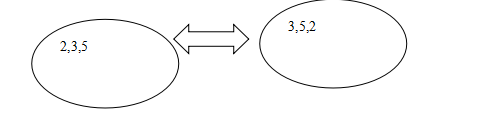
  
集合的特点:唯一性 
下面这个集合是一个错误的集合,没有满足唯一性. 
  

  
集合的运算: 求并集,求交集,笛卡尔积(相乘) 
笛卡尔积,即集合的元素,做两两的组合.
  

  
集合A<em>B = 什么?  
  
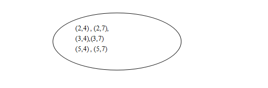
   
一道数学题: 
集合A 有 M个元素 
集合B, 有N个元素 
A</em>B = C  
C 有多少个元素? 答: M*N行 
表与集合的关系  

一张表就是一个集合 
每一行就是一个元素  

疑问:集合不能重复,但我有可能两行数据完全一样 
答:mysql内部每一行,还有一个rowid.  

两表做全相乘 
从行的角度来看: 就是2表每一行,两两组合. 
从列的角度来看: 结果集中的列,是两表的列名的相加. 
  
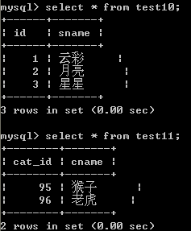
  
  
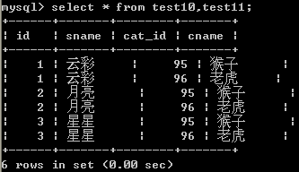
   
作全相乘时,也可以有针对性的取出某几列. 
左连接的语法:  

<pre>
假设A表在左,不动,B表在A表的右边滑动.  
A表与B表通过一个关系来筛选B表的行.  
语法:
A left join B on 条件  条件为真,则B表对应的行,取出  

A left join B on 条件   
这一块,形成的也是一个结果集,可以看成一张表 设为C
既如此,可以对C表作查询,自然where,group ,having ,order by ,limit 照常使用

问:C表的可以查询的列有哪些列?
答: A B的列都可以查
</pre>

/*
左连接 右连接,内连接的区别在哪儿?

*/

同学见面会:
  
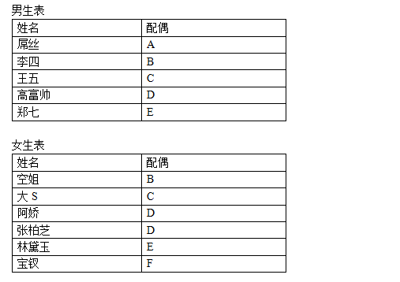
  
  
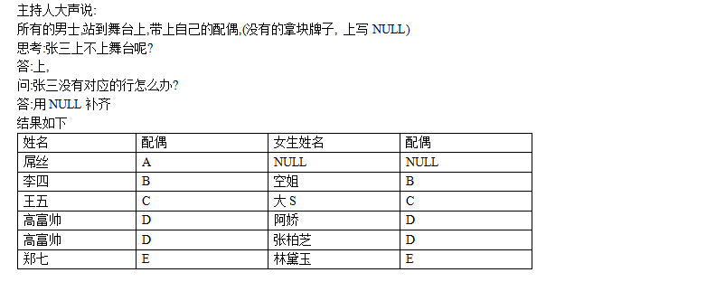
     

这种情况就是  男生  left join 女生.  

主持人说:所有女生请上舞台,有配偶的带着, 没有的,写个NULL补齐. 
Select 女生 left join 男生 on 条件  

左右连接是可以互换的 
A left join B, 就等价于 B right join A  

注意：既然左右连接可以互换，尽量用左连接，出于移植时兼容性方面的考虑．  

  

   

如果从集合的角度  

<pre>
A inner join B
和　left join /right　join的关系
答：　内连接是左右连接的交集
</pre>

问题：  

<pre>
主持人说：所有男生／女生，走上舞台．
有配偶的，带着配偶；
没配偶的，拿牌子写ＮＵＬＬ
即：结果是左右连接的并集

这种叫做外连接，但是，在mysql中不支持外连接
</pre>

两道题！
1:预习union，合并结果集,完成外连接的效果．
2:秘籍5.4用友面试题

  
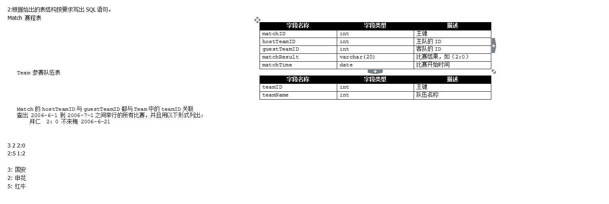
  

<pre>
Union:合并2条或多条语句的结果
语法:
Sql1 union sql2

能否从2张表查询再union呢?
答:可以,union 合并的是"结果集",不区分在自于哪一张表.

问:取自于2张表,通过"别名"让2个结果集的列一致.
那么,如果取出的结果集,列名字不一样,还能否union.
答:可以,如下图,而且取出的最终列名,以第1条sql为准 
</pre>

  

  

问: union后结果集,可否再排序呢? 
答:可以的. 
Sql1 union sql2 order by 字段 
注意: order by 是针对合并后的结果集排的序.  

问: 使用order by 的注意事项 
如下,内层语句的desc怎么没发挥作用呢? 
  
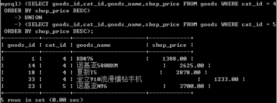
   

<pre>
思考如下语句:
(SELECT goods_id,cat_id,goods_name,shop_price FROM goods WHERE cat_id = 4 ORDER BY shop_price DESC)
UNION
(SELECT goods_id,cat_id,goods_name,shop_price FROM goods WHERE cat_id = 5 ORDER BY shop_price DESC)
order by shop_price asc;

外层语句还要对最终结果,再次排序.
因此,内层的语句的排序,就没有意义.

因此:内层的order by 语句单独使用,不会影响结果集,仅排序,
在执行期间,就被Mysql的代码分析器给优化掉了.
内层的order by 必须能够影响结果集时,才有意义.
比如 配合limit 使用. 如下例.

思考下个问题:
查出: 第3个栏目下,价格前3高的商品,和第4个栏目下,价格前2高的商品.
用union来完成
</pre>

  
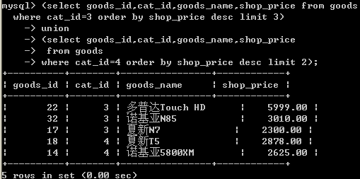
   
这一次:内层的order by 发挥了作用,因为有limit ,order 会实际影响结果集,有意义.  

如果Union后的结果有重复(即某2行,或N行,所有的列,值都一样),怎么办? 
答:这种情况是比较常见的,默认会去重.  

问:如果不想去重怎么办? 
答: union all  

如果mysql函数和PHP函数都实现某个功能,优先用哪一个?  

1:mysql的函数肯定是要影响查询速度. 
应该在建表时,通过合理的表结构减少函数的使用. 
比如 email ,按@ 前后拆分.  

2:如果确实要用函数, 
比如 时间的格式化 
在mysql里用date_format,在php里用date可以实现 
优先放在业务逻辑层,即php层处理.  

3:在查询时使用了函数,最大的一个坏处, 
以 date_format(A)为例 
则A列的索引将无法使用.  

如果你针对某列作操作,而此次查询,又使用的此列的索引. 
此时,速度将显著变慢.  

例:  
sname, email 两列 
email加了索引  

Select name,email from table where right(email,6)='qq.com'; 
将会导致此次查询中, email的索引并不会产生效果.  

<h5>视图 view</h5>

在查询中,我们经常把查询结果 当成临时表来看. 
View是什么? View可以看一张虚拟表. 是表通过某种运算得到的一个投影.
  

     
既然视图只是表的某种查询的投影,所以主要步骤在于查询表上. 
查询的结果命名为视图就可以了.  

<h4>视图的定义:</h4>

视图是由查询结果形成的一张虚拟表.

<h4>视图的创建语法:</h4>

Create view 视图名 as  select 语句;

<h4>视图的删除语法:</h4>

Drop view 视图名

<h4>为什么要视图?</h4>

答:

<h5>1:可以简化查询</h5>
<h5>2: 可以进行权限控制</h5>

把表的权限封闭,但是开放相应的视图权限,视图里只开放部分数据  

<h5>3: 大数据分表时可以用到</h5>

比如,表的行数超过200万行时,就会变慢, 
可以把一张的表的数据拆成4张表来存放.  
News表 
Newsid, 1,2,3,4 
News1,news2,news3,news4表  

把一张表的数据分散到4张表里,分散的方法很多, 
最常用可以用id取模来计算.  
Id%4+1 = [1,2,3,4]  

比如 $_GET['id'] = 17, 
17%4 + 1 = 2,  $tableName = 'news'.'2'  

Select * from news2 where id = 17;

还可以用视图, 把4张表形成一张视图
Create view news as  select from n1 union select from n2 union.........

<h5>视图的修改</h5>

Alter view 视图名 as select xxxxxx

视图是表的一个影子.
表与视图,数据变化时的相互影响问题.

<h5>视图与表的关系</h5>

视图是表的查询结果,自然表的数据改变了,影响视图的结果.

<h5>视图改变了呢?</h5>

0: 视图增删改也会影响表
1: 但是,视图并是总是能增删改的.

视图某种情况下,是可以修改的.
要求: 视图的数据和表的数据 11对应. 就像函数的映射.
表--&gt;推出视图对应的数据
视图--&gt;推出表对应的数据
对于视图insert还应注意,
视图必须包含表中没有默认值的列.
  
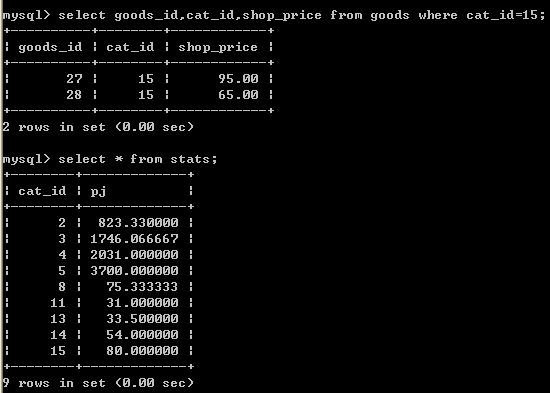
   
以这个例子而言,平均价来自于多行的的shop<em>price的计算结果. 
如果pj列的值的变子,映射过去,到底修改哪几行shop</em>price?

<h5>视图的algorithm</h5>

Algorithm = merge/ temptable/ undefined 
Merge: 当引用视图时,引用视图的语句与定义视图的语句合并. 
Temptable:当引用视图时,根据视图的创建语句建立一个临时表 
Undefined:未定义,自动,让系统帮你选.  

Merge,意味着视图只是一个规则,语句规则, 当查询视图时, 
把查询视图的语句(比如where那些)与创建时的语句where子句等合并,分析. 
形成一条select 语句.  

<pre>
例: 创建视图的语句:
mysql> create view g2 as select goods_id,cat_id,goods_name,shop_price from goods where shop_price>2000
查询视图的语句:
select * from g2  where shop_price < 3000;
</pre>

最终执行的语句:

<pre>
select goods_id,cat_id,goods_name,shop_price from goods where shop_price > 2000 and shop_price < 3000
</pre>

而temptable是根据创建语句瞬间创建一张临时表,
然后查询视图的语句从该临时表查数据.

<pre>
create algorethm=temptable view g2 as select goods_id,cat_id,goods_name,shop_price from goods where shop_price > 2000
</pre>

查询视图的语句:

<pre>
 select * from g2  where shop_price < 3000;
</pre>

最终执行的2句话: 取数据并放在临时表,然后去查临时表.

<pre>
Select  goods_id,cat_id,goods_name,shop_price from goods where shop_price > 2000;
========> temptable
</pre>

再次查临时表

<pre>
Select * from temptable where shop_price< 3000
</pre>

字符集与校对集

<pre>
Create table 表名(
列声明
) charset utf8;
</pre>

Mysql的字符集设置非常灵活 
可以设置服务器默认字符集 
数据库默认字符集 
表默认字符集 
列字符集 
如果某一个级别没有指定字符集,则继承上一级.  

以表声明utf8为例: 
存储的数据在表中,最终是utf8; 
  
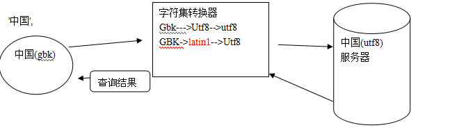
  
1:告诉服务器,我给你发送的数据是什么编码的? character<em>set</em>client 
2:告诉转换器,转换成什么编码? Character<em>set<em>connection 
3:查询的结果用什么编码? Character</em>set</em>results   

如果以上3者都为字符集N, 则可以简写为 set names N  

推论: 什么时将会乱码? 
1: client声明与事实不符 
2:results与客户端页面不符的时候.  

什么时间将会丢失数据? 
Connetion和服务器的字符集比client小时. 
  
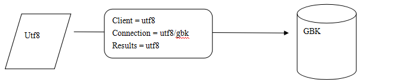
   
校对集: 指字符集的排序规则 
一种字符集可以有一个或多个排序规则. 
以Utf8为例, 我们默认使的utf8<em>general</em>ci 规则,也可以按二进制来排, utf8_bin  

怎么样声明校对集?  

<pre>
Create table ()... Charset utf8 collate utf8_general_ci;  

注意:声明的校对集必须是字符集合法的校对集.  
</pre>

  
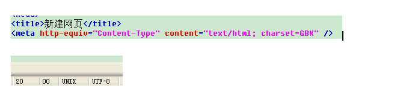
  

<h4>存储引擎</h4>

一部电影, mp4,wmv,avi,rmvb,flv, 同样的一部电影,在硬盘上有不同的存储格式, 
所占空间与清晰程度也不一样.  

表里的数据存储在硬盘上,具体如何存储的? 
存储的方式方法也有多种.  

对于用户来说       同样一张表的数据,无论用什么引擎来存储,用户看到的数据是一样的. 
但是对于服务器来说,有区别.  

常用的表的引擎 
Myisam ,批量插入速度快, 不支持事务,锁表 
Innodb, 批量插入相对较慢,支持事务,锁行.  

全文索引:目前5.5版本,myisam,innodb都已经支持  

<h5>事务:</h5>
<pre>
通俗的说事务: 指一组操作,要么都成功执行,要么都不执行.---->原子性
在所有的操作没有执行完毕之前,其他会话不能够看到中间改变的过程-->隔离性
事务发生前,和发生后,数据的总额依然匹配----->一致性
事务产生的影响不能够撤消------>持久性
如果出了错误,事务也不允许撤消, 只能通过"补偿性事务"

转账
李三: --->支出 500, 李三 -500
赵四: ---->收到500, 赵四 +500

关于事务的引擎:
选用innodb /bdb

开启事务:  start transaction;
Sql....
Sql....

Commit 提交

rollback 回滚

注意: 当一个事务commit,或者rollback就结束了

注意:有一些语句会造成事务的隐式的提交,比如 start transaction
</pre>

事务 的基本原理 (了解) 
  
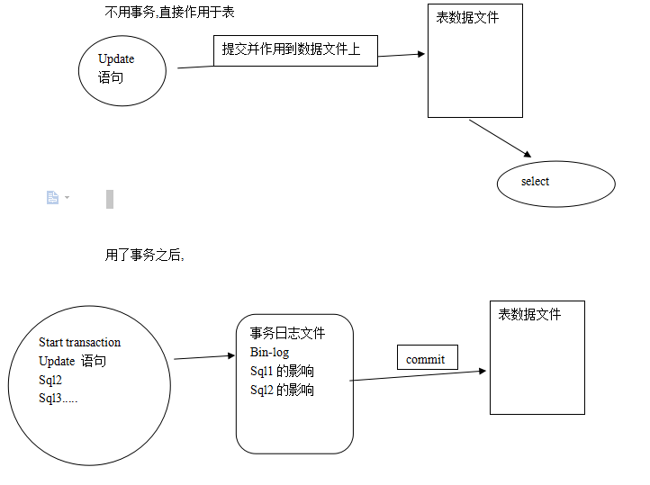
   

<h4>触发器:trigger, 枪击,扳击,引线的意思</h4>

一触即发, 
作用: 监视某种情况并触发某种操作. 
  
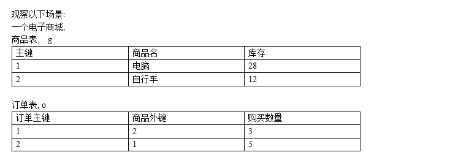
   
完成下单与减少库存的逻辑 
Insert into o (gid,num) values (2,3);  // 插入语句 
Update g set goods<em>num = goods</em>num - 3 where id = 2;// 更新过程  

这两个逻辑可以看成一个整体,或者说, insert ---&gt; 引来 update  

用触发器可以解决上述问题.   
我们可以监视某表的变化,当发生某种变化时,触发某个操作.    

触发器:  
能监视: 增,删,改 
触发操作: 增,删,改  

四要素: 
监视地点 
监视事件 
触发时间 
触发事件  

<h5>创建触发器的语法</h5>
<pre>
Create trigger triggerName 
After/before insert/update/delete  on 表名
For each row #这句话是固定的
Begin
Sql语句;  # 一句或多句,insert/update/delete范围内
End;
</pre>
<h5>删除触发器的语法:</h5>
<pre>
Drop trigger 触发器名
</pre>
<h5>查看触发器</h5>
<pre>
Show triggers
</pre>
<h5>如何在触发器引用行的值</h5>
<pre>
对于insert而言, 新增的行 用new 来表示,
行中的每一列的值 ,用new.列名来表示.

对于 delete来说, 原本有一行,后来被删除,
想引用被删除的这一行,用old,来表示,  old.列名,就可以引用被删行中的值.

对于update来说,
被修改的行, 
修改前的数据 ,用 old来表示, old.列名引用被修改之前行中的值
修改后的数据,用new 来表示, new.列名引用被修改之后行中的值
</pre>
<h5>触发器里after 和before的区别</h5>
<pre>
After 是先完成数据的增,删,改再触发,
触发的语句晚于监视的增,删,改,无法影响前面的增删改动作.

Before是先完成触发,再增删改,
触发的语句先于监视的增,删,改发生,我们有机会判断,修改即将发生的操作.
</pre>
<h5>典型案例:</h5>

对于所下订单,进行判断,如果订单的数量 &gt; 5 ,就认为是恶意订单, 
强制把所订的商品数量改成5

<h4>备份与恢复</h4>

系统运行中, 增量备份,与整体备份. 
例: 每周日整体备份一次, 周一到周六备份当天. 
如果周五出了问题,可以用周日的整体 + 周一,二,三,四来恢复.  

备份的工具 
有第3方的收费备份工作, 
目前我们所学的是系统自带的备份功能, mysqldump  

Mysqldump可以导出 
库 
表  

<h5>例1: 导出mugua库下面的表</h5>
<pre>
Mysqldump -u用户名 -p密码 库名 表1 表2 表3 > 地址/备份文件名称
导出的是建表语句及insert语句
</pre>
<h5>例2:如何导出一个库下面的所有表?</h5>
<pre>
Mysqldump -u用户名 -p密码 库名 > 地址/备份文件名称
</pre>
<h5>例3: 如何导出以库为单位导出?</h5>
<pre>
Mysqldump -u用户名 -p密码 -B 库1 库2 库3 > 地址/备份文件名称
</pre>
<h5>例4: 如何导出所有库?</h5>
<pre>
Mysqldump -u用户名 -p密码 -A > 地址/备份文件名称
</pre>

恢复: 
1:登陆到mysql命令行  

<pre>
对于库级的备份文件  
Mysql> source 备份文件地址  

对于表级的备份文件  
Mysql > use 库名    
Mysql> source 备份文件地址
</pre>

2:不登陆到mysql命令行

<pre>
针对库级的备份文件
Mysql  -u用户名 -p密码 < 库级备份文件地址

针对表级的备份文件
Mysql  -u用户名 -p密码 库名 < 表级备份文件地址
</pre>

索引 
索引:是针对数据所建立的目录. 
作用: 可以加快查询速度 
负面影响: 降低了增删改的速度.  

<h5>案例:</h5>
<pre>
设有新闻表15列,10列上有索引,共500W行数据, 如何快速导入?
1:把空表的索引全部删除
2:导入数据
3:数据导入完毕后,集中建索引.
</pre>
<h5>索引的创建原则:</h5>

1:不要过度索引 
2:在where条件最频繁的列上加. 
3:尽量索引散列值,过于集中的值加索引意义不大.  

<h5>索引的类型</h5>

普通索引: index 仅仅是加快查询速度. 
唯一索引: unique index 行上的值不能重复 
主键索引: primary key 不能重复. 
主键必唯一,但是唯一索引不一定是主键. 
一张表上,只能有一个主键, 但是可以用一个或多个唯一索引. 
全文索引 : fulltext index 
(上述3种索引,都是针对列的值发挥作用,但全文索引,可以针对值中的某个单词,比如一篇文章,)  

<h5>建立索引</h5>

可以在建表时,直接声明索引,即在列声明完毕后,声明索引.
例如下:

<pre>
create table test5 (
 id int,
 username varchar(20),
 school varchar(20),
 intro text,
 primary key (id),
 unique (username),
 index (school),
 fulltext (intro)
 ) engine myisam charset utf8;
</pre>
<h5>查看一张表上所有索引</h5>
<pre>
Show index from 表名
</pre>
<h5>建立索引</h5>
<pre>
Alter table 表名 add index /unique/fulltext [索引名] (列名)
Alter table 表名  add primary key (列名)   // 不要加索引名,因为主键只有一个
</pre>
<h5>删除索引</h5>
<pre>
删除非主键索引:Alter table 表名 drop index 索引名;
删除主键: alter table 表名 drop primary key
</pre>  
<h5>关于全文索引的用法</h5>
<pre>
Match (全文索引名) against ('keyword');
</pre>
<h5>关于全文索引的停止词</h5>
<pre>
全文索引不针对非常频繁的词做索引,
如this, is, you, my等等.
</pre>

全文索引:在mysql的默认情况下, 对于中文意义不大. 
因为英文有空格,标点符号来拆成单词,进而对单词进行索引. 
而对于中文,没有空格来隔开单词,mysql无法识别每个中文词.  

<h4>存储过程: procedure</h4>

概念类似于函数,就是把一段代码封装起来, 
当要执行这一段代码的时候,可以通过调用该存储过程来实现. 
在封装的语句体里面,可以用if/else, case,while等控制结构. 
可以进行sql编程.  

<h5>查看现有的存储过程:</h5>
<pre><code>Show procedure status
</code></pre>

<h5>删除存储过程</h5>
<pre><code>Drop procedure 存储过程的名字
</code></pre>

<h5>调用存储过程</h5>
<pre><code>Call 存储过程名字();
</code></pre>

第1个存储过程 ,体会&quot;封装sql&quot; 
 
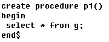
 
第2个存储过程, 体会&quot;参数&quot;
 
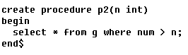
 
第3个存储过程,体会&quot;控制结构&quot;
 
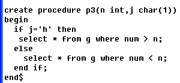
 
第4个存储过程,体会&quot;循环&quot; 
 
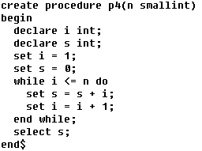
 
在mysql中,存储过程和函数的区别, 
一个是名称不同, 
二个就是存储过程没有返回值.  

